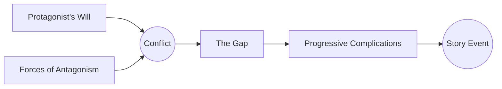

# The Law of Conflict

> 中文版：[[wiki/zh/principles/law-of-conflict|中文]]

## The Principle
**Nothing moves forward in a story except through conflict.** Story is metaphor for life, and life is lived in conflict — therefore the writer must find conflict in every scene or the scene is not a story event.

## McKee's Reasoning
Music advances on sound and silence; dance on movement and stillness; story advances on the interplay of conflicts. Remove conflict and a scene collapses into anecdote, exposition, or sentimentality. Conflict is not mere argument — it is any resistance life offers to the protagonist's will, at any of the [[levels-of-conflict]].

## In Practice
- Every scene should express at least one layer of conflict (inner, personal, or extra-personal).
- When a scene feels dead, test for missing antagonism — not "who is the villain" but "what opposes this will at this moment."
- Conflict need not be loud; subtext conflict is often strongest.

## Film Examples
- *Ordinary People* — The dinner table is a battleground of unspoken conflict.
- *Chinatown* — Every scene, even expository ones, carries pressure from competing wants.

## Violations and Consequences
- **Flat scenes:** dialogue without resistance, no value-change — the scene is non-event.
- **Melodrama:** confusing loud conflict with deep conflict.
- **Sentimentality:** emotion without the friction that would earn it.

## Sources
- *Story* Chapter 9
