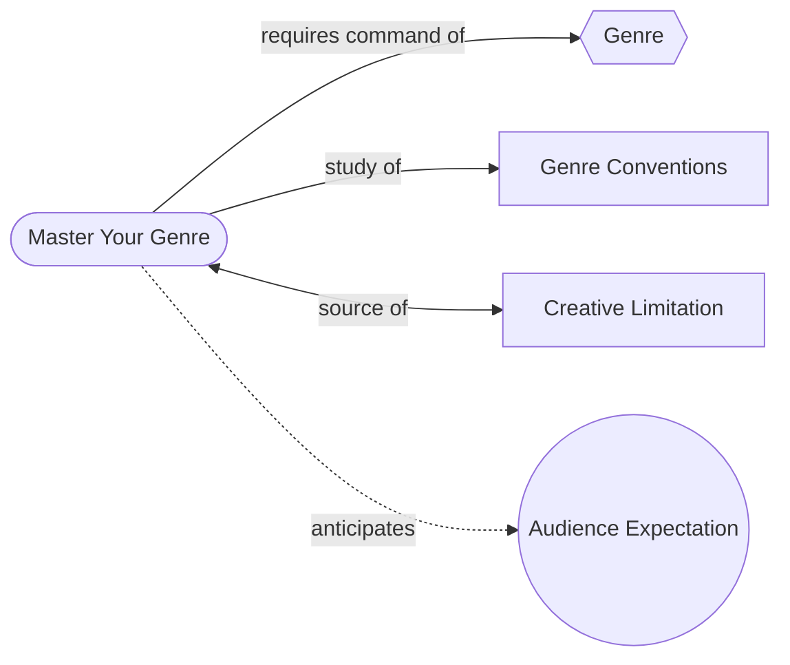

# Master Your Genre

> 中文版：[[wiki/zh/principles/master-your-genre|中文]]

## The Principle

You must not only respect but master your genre and its conventions. Never assume that because you've seen films in your genre you know it — this is like assuming you could compose a symphony because you've heard all nine of Beethoven's. To anticipate the anticipations of the audience, you must master your genre and its conventions.

## Concept Map

## McKee's Reasoning

The audience arrives at every film as a genre expert, positioned by marketing and a lifetime of moviegoing to expect specific patterns. If the writer's genre knowledge doesn't surpass the audience's, the audience will always be one step ahead — and boredom follows. The writer must study genre systematically, not casually.

McKee also argues that genre mastery provides **endurance** — the stamina to sustain the months or years a screenplay demands. The love of ideas and self-expression will rot and die before the script is finished; the love of your genre will sustain you.

## In Practice

McKee prescribes a specific method for genre study:

1. List all works similar to yours — both successes and failures ("the study of failures is illuminating… and humbling")
2. Rent/purchase the films and screenplays
3. Study stop-and-go, breaking each film into elements of setting, role, event, and value
4. Stack analyses and look down through them all: "What do the stories in my genre always do? What are its conventions of time, place, character, and action?"

## Film Examples

- **[[chinatown]]** — Towne and Polanski's "absolute command of genre" allowed them to break the Murder Mystery convention (criminal escapes punishment) at exactly the moment society was ready for it. A classic born from mastery.
- **Alfred Hitchcock** — Worked solely within Archplot and genre convention, aimed for mass audiences, and is now worshipped as one of cinema's major artists. Proves there is no contradiction between genre mastery and art.

## Violations and Consequences

- **Mike's Murder** — Marketed as a Murder Mystery but was actually a Maturation Plot. The mispositioning confused the audience and killed the film's "legs" despite good writing.
- **Falling in Love** — Used 1950s Love Story conventions (marriage as blocking force) in the 1980s when attitudes had shifted. The audience found it antiquated and boring.

## Sources

- *Story* Chapter 4, "Mastery of Genre" and "The Gift of Endurance"
