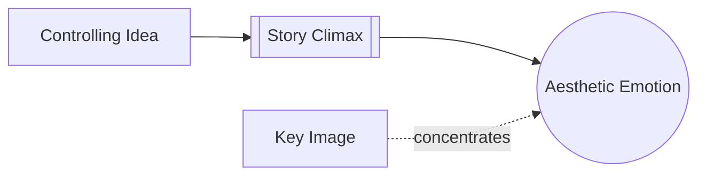

# Meaning Produces Emotion

> 中文版：[[wiki/zh/principles/meaning-produces-emotion|中文]]

## The Principle
The audience's deepest emotion comes from meaningful value change, not from noise, sentiment, stars, or spectacle by themselves.

## McKee's Reasoning
McKee argues that climax matters when it expresses a decisive shift in value at maximum charge. A quiet departure can devastate if it completes the story's meaning; a battle can feel empty if it does not.

## In Practice
Design the ending around what the action means, then find the image and action that embody that meaning cleanly.

## Film Examples
- **[[ordinary-people]]** — Beth's leaving is emotionally immense because of what it means.
- **[[the-deer-hunter]]** — The climax resonates because symbolic charge and moral meaning converge.

## Violations and Consequences
When writers mistake volume for meaning, the audience may register intensity but not catharsis.

## Sources
- *Story* Chapter 13

