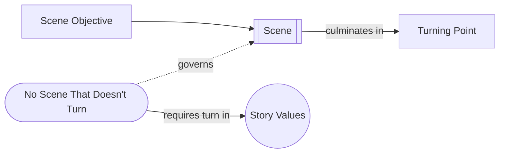

# No Scene That Doesn't Turn

> 中文版：[[wiki/zh/principles/no-scene-that-doesnt-turn|中文]]

## The Principle

Every scene must turn the value-charged condition of a character's life. If the value at the end of the scene is the same as at the beginning, nothing meaningful has happened and the scene should be cut or rebuilt.

## Concept Map

## McKee's Reasoning

McKee states this first as a structural ideal and later grounds it in scene design and scene analysis. A scene exists to pursue an objective, collide with resistance, and arrive at a new value state. If it does not turn, it is usually doing the work of explanation instead of drama.

## In Practice

For every scene: (1) define the [[scene-objective]], (2) note the opening value, (3) track the beats, (4) note the closing value, and (5) locate the [[turning-point]]. If nothing changes, move the information elsewhere.

## Film Examples

- **[[tender-mercies]]** — Quiet scenes still turn the value of Sledge's life.
- **[[casablanca]]** — The bazaar encounter shows that even layered subtext must obey the rule.
- *Die Hard*, *The Fugitive*, *Straw Dogs* — Clearly meet the test with external value turns
- *Remains of the Day*, *The Accidental Tourist* — Meet the test with subtler internal value turns

## Violations and Consequences

Scenes that don't turn produce a "lifeless collection of predictable, ill-told, and clichéd episodes" (as McKee describes in his typical coverage report). The story stalls, the audience loses interest, and the work degenerates into either static portraiture or empty spectacle.

## Sources

- *Story* Chapters 2, 10, and 11
