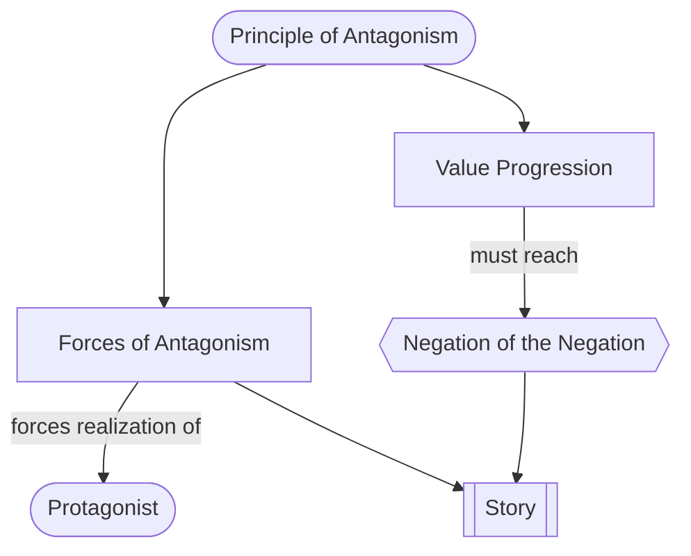

# The Principle of Antagonism

> 中文版：[[wiki/zh/principles/principle-of-antagonism|中文]]

## The Principle
**A protagonist and his story can only be as intellectually fascinating and emotionally compelling as the forces of antagonism make them.** McKee calls this "the most important and least understood precept in story design" and the primary reason screenplays fail.

## McKee's Reasoning
Human nature is fundamentally conservative. No one expends energy, takes risks, or changes unless they must. The writer's only leverage to force a [[protagonist]] into deeper and truer choices, and so into a multidimensional character and a powerful story, is on the *negative* side of the story. The positive answers negativity; it does not generate itself.

Weighing the protagonist at the [[inciting-incident]], the sum of his willpower and his intellectual/emotional/social/physical capacities must feel outmatched by the total [[forces-of-antagonism]] — internal, personal, institutional, environmental. He has a chance; he is not favored. Without that imbalance there is no quest worth watching.

## In Practice
- When a story is weak, the fault is almost always weak antagonism. Do not try to make the hero more charming; deepen the negation.
- Identify the primary value at stake and run it down the [[value-progression]] — Positive → Contrary → Contradictory → [[negation-of-the-negation|Negation of the Negation]].
- Map the antagonism across all [[levels-of-conflict]], not just one. The sum must feel overwhelming at the Inciting Incident.
- "Forces of antagonism" is not the same as an antagonist. Superb arch-villains are welcome in some genres, but a story can have enormous antagonism without a single villain.
- Reach the end of the line somewhere in the telling. A story that never crosses into the Negation of the Negation can be satisfying, never sublime.

## Film Examples
- **[[casablanca]]** — Opens at the Negation of the Negation on three values at once (freedom, love, integrity) and climbs back to the Positive.
- **[[chinatown]]** — Antagonism compounds until the Negation of the Negation (incest with the offspring of incest) is revealed; this is why the protagonist cannot win.
- *Superman* (Puzo's design) — Kryptonite alone is not enough; Puzo invents a lesser-of-two-evils choice (New Jersey vs. California) and then a dilemma of irreconcilable goods (his father's law vs. Lois's life) to make an almost-god into an underdog.
- *Big* — Leaps to the Negation of the Negation (a child trapped in adult life), then illuminates every shade of immaturity.

## Violations and Consequences
- **Weak forces of antagonism:** the protagonist feels able to handle the story at any moment; no tension accumulates, no character depth is forced.
- **Stopping at the Contradictory:** the story reads as a conventional crime drama, romance, or adventure — competent, never memorable.
- **Antagonism confined to one level:** e.g., a villain with no institutional, environmental, or inner dimensions — the protagonist bests him and the story ends on fumes.
- **Hero-first design:** the writer pours energy into making the protagonist lovable instead of making the opposition ruinous; the result is a flat, under-motivated character.

## Sources
- *Story* Chapter 14
