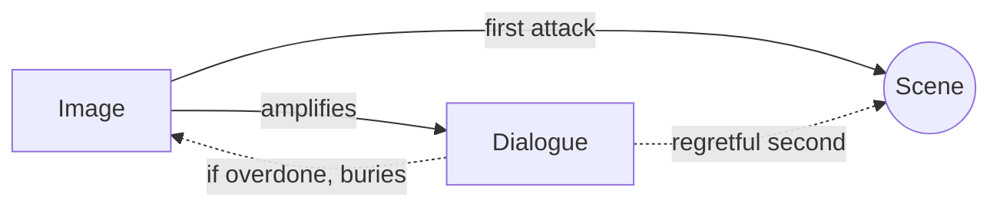

# The Silent Screenplay

> 中文版：[[wiki/zh/principles/silent-screenplay|中文]]

## The Principle
**Image first; dialogue a regretful second.** Never write a line of dialogue when a visual expression could carry the moment. Lean dialogue, set in relief against primarily visual storytelling, acquires power; a soundtrack crowded with talk erases it.

## McKee's Reasoning
Film is 80% visual, 20% auditory. The camera is an X-ray for anything false or forced. Dialogue is the *last* layer added to a screenplay, because the premature writing of dialogue chokes creativity — writers fall in love with their lines and refuse to restructure scenes. The Law of Diminishing Returns applies: the more dialogue, the less effect each line has.

Hitchcock: "When the screenplay has been written *and the dialogue has been added*, we're ready to shoot."

## In Practice
- **First attack on every scene:** How could I write this in a purely visual way?
- **Write dialogue last.** Even after treatment; never treat "script" as "dialogue."
- **Keep lines lean.** Short, suspense-sentence shape. See [[dialogue]] and [[suspense-sentence]].
- **Let descriptions carry the scene.** See [[description]].
- **Seed image systems.** See [[image-systems]].
- **Trust the audience.** "Show, don't tell" is respect for their intelligence.

## Film Examples
- *The Silence* (Bergman) — The waiter-seduction scene: a dropped napkin, a slow sniff, a long breath. Zero dialogue, maximum charge.
- *2001: A Space Odyssey* — Long sequences of silent visual storytelling.
- Charlie Chaplin's features — The entire Silent Era demonstrates how much story can be told without a word.

## Violations and Consequences
- **Dialogue-driven scripts** read as radio plays with descriptions attached.
- **Illustrated audiobooks** — voice-over-heavy films that McKee warns are degrading cinema into "Classic Comics."
- **Literary overwriting** — clever lines that jump off the page; actors cut them on set.
- **Talking heads** — long speeches uncut by action/reaction.

## Sources
- *Story* Chapter 18 (The Silent Screenplay)
- *Story* Chapter 6 (parent: [[dramatize-dont-explain]])
