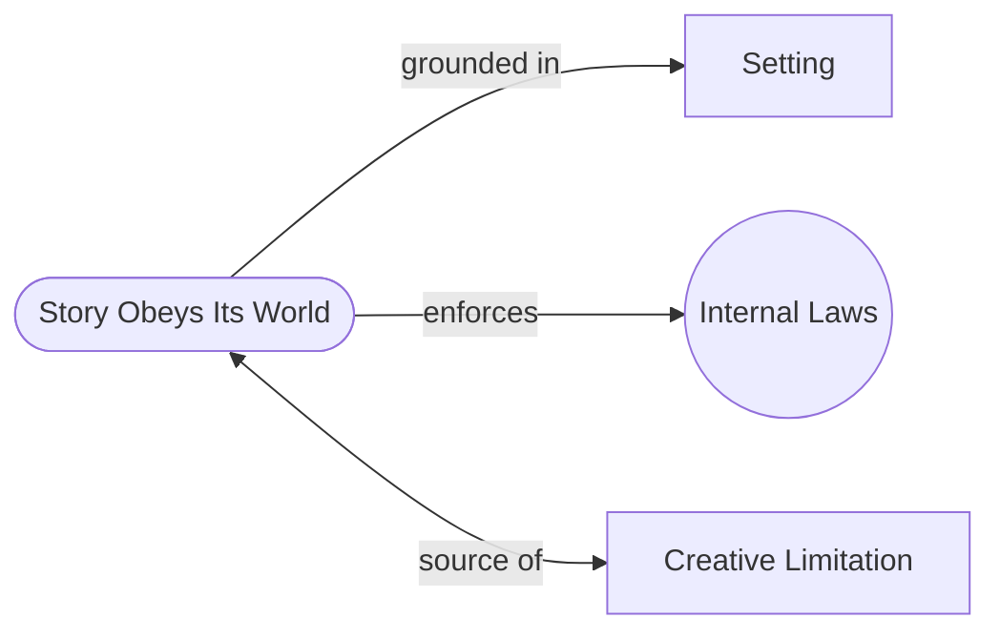

# A Story Must Obey Its Own World

> 中文版：[[wiki/zh/principles/story-obeys-its-world|中文]]

## The Principle

A story must obey its own internal laws of probability. Each fictional world creates a unique cosmology and its own "rules" for how and why things happen. Once those causal principles are established, they cannot change. The writer's event choices are limited to the possibilities and probabilities within the world he creates.

## Concept Map

## McKee's Reasoning

From the first image, the audience inspects the fictional universe, sorting the possible from the impossible, the likely from the unlikely. Consciously and unconsciously, audiences want to learn the "laws" of the story's reality. Once they grasp those laws, any violation feels like a breach of contract — the work is rejected as illogical and unconvincing.

Paradoxically, the more fantastical the setting, the stricter the internal logic must be. Fantasy gives the writer one great leap away from reality, then demands tight-knit probabilities and no coincidence. Conversely, gritty realism sometimes allows leaps in logic if grounded by a different kind of internal consistency.

## In Practice

- Establish the causal principles of your world early and clearly
- Never break the rules once established, no matter how convenient it would be for the plot
- The more fantastical the premise, the more rigorous the internal logic must be
- Remember: the audience is always testing your world's rules

## Film Examples

- **The Wizard of Oz** — One great fantasy leap (tornado to Oz), then strict Archplot logic throughout
- **The Usual Suspects** — Arrests wild improbabilities inside the "law" of free association, making them feel coherent within its world

## Violations and Consequences

When writers break the internal laws of their fictional world, the audience loses trust. The violation registers as a logical error that shatters the dream of the story. Even if individual scenes are well-crafted, an inconsistent world makes the whole feel dishonest.

## Sources

- *Story* Chapter 3, "The Relationship Between Structure and Setting"
