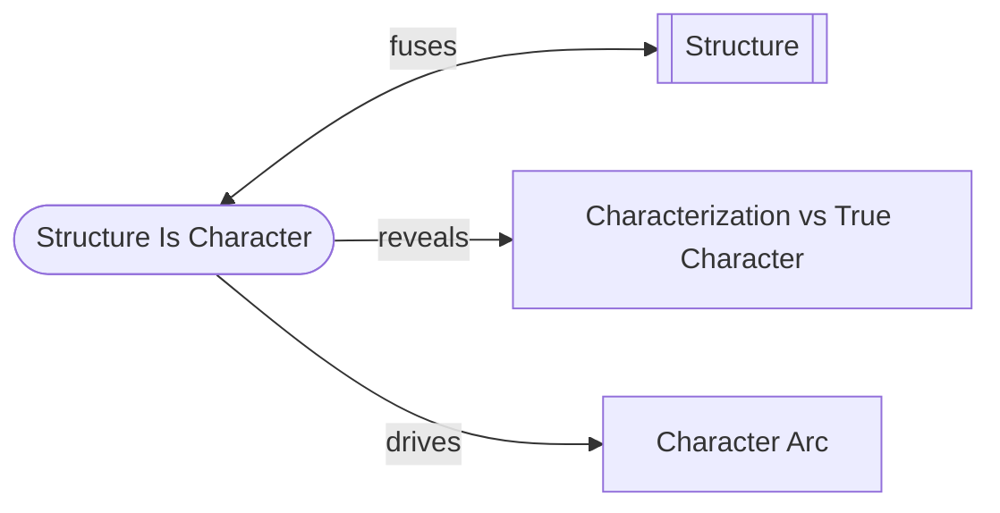

# Structure Is Character

> 中文版：[[wiki/zh/principles/structure-is-character|中文]]

## The Principle

Structure is character; character is structure. They are the same thing. The function of structure is to provide progressively building pressures that force characters into more and more difficult choices, revealing their true natures. The function of character is to bring the qualities of characterization necessary to credibly act out those choices. If you change one, you change the other.

## Concept Map

## McKee's Reasoning

The phrase "character-driven story" is redundant — all stories are character-driven. Event design and character design mirror each other. The event structure is created out of characters' choices under pressure, while characters are revealed and changed by how they choose to act under pressure.

If you change event design, you change character: a protagonist who tells the truth in one draft and lies in the next is a wholly different person, even if his characterization remains identical. If you change deep character, you must reinvent structure: a changed character must make new choices, take different actions, and live another story — *his* story.

## In Practice

- Never develop "character" separately from "plot" — they are inseparable
- Test every event by asking: what choice does this force, and what does that choice reveal?
- Test every character by asking: what events would this nature produce?
- Adjust characterization (surface traits) to support the credibility of climactic choices — plot is more important than characterization, but structure and true character are one

## Film Examples

- **[[the-verdict]]** — The structure (a medical malpractice case against the Catholic Church) is designed to create exactly the escalating pressure that arcs Frank Galvin from self-destruction to redemption
- **Greed** — The Mojave climax demands that characterization serve the climactic choice; the protagonist's age was adjusted to make the desert pursuit credible

## Violations and Consequences

When writers develop "interesting characters" with no structural pressure to reveal them, the result is characterization without character — surface without depth. When writers design elaborate plots with no thought to what choices reveal, the result is spectacle without meaning.

## Sources

- *Story* Chapter 5, "Structure and Character Functions"
