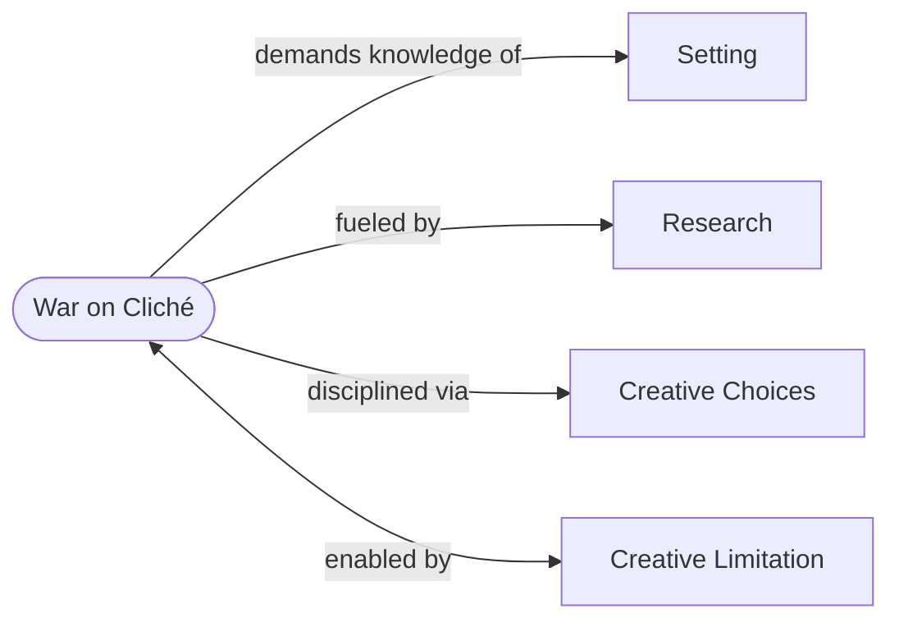

# The War on Cliché

> 中文版：[[wiki/zh/principles/war-on-cliche|中文]]

## The Principle

The source of all clichés can be traced to one thing alone: **the writer does not know the world of his story.** When writers lack deep knowledge of their fictional universe, they inevitably borrow from other films and novels — reheating literary leftovers. The antidote is exhaustive knowledge of the story's [[setting]], achieved through [[research]], expressed through disciplined [[creative-choices]].

## Concept Map

## McKee's Reasoning

Modern audiences are the most story-saturated in history, consuming in a single day what previous generations consumed in a week. By the time filmgoers sit down to a new work, they've absorbed tens of thousands of hours of story. Cliché is the inevitable result when a writer, reaching into an insufficiently prepared mind for material, comes up empty and runs to other works for ideas. The "worldwide epidemic" of audience dissatisfaction has this single, clear cause.

## In Practice

1. **Know your world.** Research the story's setting through memory, imagination, and fact until you possess commanding knowledge — so deep that no relevant question could stump you.
2. **Make your world small and specific.** A limited, knowable world is the precondition for originality. Refuse the temptation of vagueness.
3. **Overproduce, then select.** Generate material at ratios of 10:1 or 20:1, then choose only what is truest to character, truest to world, and has never been done this way before.
4. **Distrust first ideas.** "Inspiration" is usually the first cliché grabbed from the top of your head.

## Film Examples

- McKee's hypothetical "East Side romantic comedy" — the singles bar meet-cute is the first idea (cliché). The disciplined writer generates a dozen alternatives, or digs deeper into the singles bar world to find its authentic truth.

## Violations and Consequences

Writers who don't know their story's world produce work the audience has seen before: predictable endings, recycled characters, borrowed scenes. The result is audience boredom and dissatisfaction — the "plague" McKee diagnoses at the chapter's opening. "Regardless of their talents, they lack an in-depth understanding of their story's setting and all it contains."

## Sources

- *Story* Chapter 3, "The War on Cliché"
