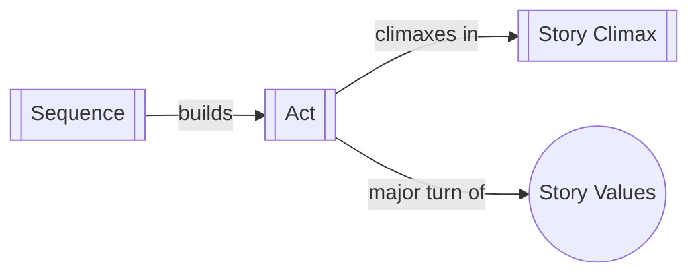

# Act

> 中文版：[[wiki/zh/structures/act|中文]]

## Definition

An Act is a series of sequences that peaks in a climactic scene which causes a major reversal of values, more powerful in its impact than any previous sequence or scene.

## Concept Map

## Position in the Story Hierarchy

- **Above:** [[story-climax]] — Acts build toward the Story Climax; the last act's climax is the Story Climax
- **Below:** [[sequence]] — Sequences compose acts through escalating impact
- **This level:** A major movement of the story that turns on a significant reversal in the character's life

## McKee's Argument

Acts represent the largest structural movements within a story before the story itself. The difference between a scene, a sequence climax, and an act climax is the degree of change—more precisely, the degree of impact that change has on the character's inner life, personal relationships, or fortunes in the world. An act climax is a major, potentially life-altering reversal.

## How It Works

McKee illustrates with his extended example: An Act One might take a character from NO JOB to PRESIDENT OF THE CORPORATION. Act Two's corporate wars lead to betrayal and being FIRED. Act Three shows her armed with secrets, destroying her former employers. The acts arc from hardworking/optimistic/honest to ruthless/cynical/corrupt—absolute, irreversible change across the story.

## Film Examples

- **[[tender-mercies]]** — Act structure traces Mac Sledge's journey from meaninglessness through small threads of connection to a life worth living
- *E.T.* — Act Two climax features death, then reversed (revival) leading to the irreversible Act Three climax

## Relationship to Other Concepts

- [[sequence]] — Sequences are the building blocks of acts
- [[story-climax]] — The climax of the last act is the story climax
- [[story-values]] — Act climaxes create major value reversals

## Common Mistakes

Confusing a sequence climax with an act climax. The key difference is magnitude of impact: act climaxes create major, often irreversible changes in the character's situation, while sequence climaxes are significant but smaller.

## Sources

- *Story* Chapter 2, "The Structure Spectrum"
