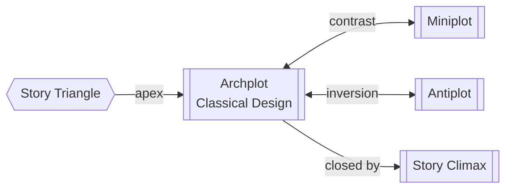

# Archplot (Classical Design)

> 中文版：[[wiki/zh/structures/archplot|中文]]

## Definition

Classical Design means a story built around an active protagonist who struggles against primarily external forces of antagonism to pursue his or her desire, through continuous time, within a consistent and causally connected fictional reality, to a closed ending of absolute, irreversible change.

McKee calls this the "Archplot"—Arch (pronounced "ark" as in archangel) in the dictionary sense of "eminent above others of the same kind."

## Concept Map

## Position in the Story Hierarchy

- **Position:** At the apex of [[the-story-triangle]]
- **Contrast with:** [[miniplot]] (which reduces classical elements) and [[antiplot]] (which reverses them)
- **This level:** The dominant and most universal form of story design

## McKee's Argument

Classical Design is timeless and transcultural, fundamental to every earthly society, reaching back through millennia of oral storytelling. When *Gilgamesh* was carved in cuneiform 4,000 years ago, these principles were already fully in place. The Archplot is "the meat, potatoes, pasta, rice, and couscous of world cinema"—the form that has informed the vast majority of internationally successful films for over a century.

McKee argues that Archplot mirrors the human mind: it reflects how we naturally remember the past, anticipate the future, and perceive causality, time, and agency. It is neither Western nor Eastern—it is human.

## How It Works

The Archplot features:
- **Active protagonist** — willfully pursues desire through escalating conflict
- **External conflict** — emphasis on struggles with people, institutions, physical world
- **Single protagonist** — one major story dominates screentime
- **Linear time** — continuous temporal order the audience can follow
- **Causality** — motivated actions cause effects in a chain reaction
- **Consistent reality** — internal rules of the fictional world are maintained
- **Closed ending** — all questions answered, all emotions satisfied

## Film Examples

Examples span decades and continents: *The Great Train Robbery* (1904), *Greed* (1924), *Citizen Kane* (1941), *The Seven Samurai* (1954), *The Godfather Part II* (1974), *A Fish Called Wanda* (1988), *Thelma & Louise* (1991), *Shine* (1996)—staggering variety within Classical Design.

## Relationship to Other Concepts

- [[miniplot]] — Shrinks or compresses Archplot elements
- [[antiplot]] — Reverses and contradicts Archplot elements
- [[the-story-triangle]] — Archplot sits at the apex of the triangle
- [[master-classical-form]] — McKee insists writers must master Archplot before attempting other forms

## Common Mistakes

Confusing Classical Design with "formula" or "hack commercialism." McKee explicitly argues that Archplot encompasses enormous variety and demands mastery. Also: forcing positive endings for commercial reasons rather than truth.

## Sources

- *Story* Chapter 2, "The Structure Spectrum"
