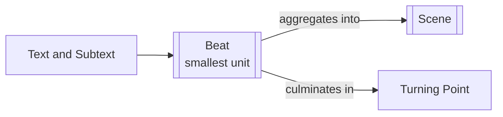

# Beat

> 中文版：[[wiki/zh/structures/beat|中文]]

## Definition

A Beat is an exchange of action and reaction in behavior. Beat by beat, those shifts create the inner life of a scene and prepare its [[turning-point]]. It should not be confused with the screenplay notation `[beat]` meaning a pause in dialogue.

## Concept Map

## Position in the Story Hierarchy

- **Above:** [[scene]] — Beats build scenes; a series of beats composes the arc of a scene
- **Below:** None — the Beat is the smallest element of story structure
- **This level:** An exchange of action and reaction between characters that shifts behavior within a scene

## McKee's Argument

McKee identifies the beat as the atomic unit of storytelling, then deepens the idea in Chapter 11 by making it analytical. Beats are not only surface shifts but subtextual actions: seducing, deflecting, humiliating, pleading, threatening. Without changing beats, scenes flatten into repetitive talk.

## How It Works

Each beat represents a distinctly different behavior. A new beat begins when the essential action changes. In scene analysis, writers name each side of the exchange with active phrases so they can see the scene's hidden arc and identify where the decisive turn occurs.

## Film Examples

- **[[casablanca]]** — Rick and Ilsa's scene lives through shifting beats of approach, resistance, hurt, and redefinition.
- McKee's "lovers break up" illustration — The scene turns because each beat changes its emotional tactic.

## Relationship to Other Concepts

- [[scene]] — Beats build scenes; a scene's arc is shaped by its sequence of beats
- [[text-and-subtext]] — The real action of a beat lies beneath the spoken surface
- [[turning-point]] — The final or decisive beat often triggers the turn

## Common Mistakes

McKee warns against scenes where the same tactic repeats without change. If characters begin in one behavioral mode and remain there, the scene may contain noise but no design.

## Sources

- *Story* Chapters 2 and 11
