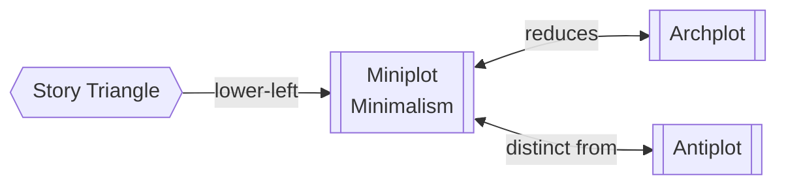

# Miniplot (Minimalism)

> 中文版：[[wiki/zh/structures/miniplot|中文]]

## Definition

Miniplot means the writer begins with the elements of Classical Design but then reduces them—shrinking, compressing, trimming, or truncating the prominent features of the [[archplot]]. Miniplot does not mean "no plot"—its story must be as beautifully executed as an Archplot.

## Concept Map

## Position in the Story Hierarchy

- **Position:** Lower-left corner of [[the-story-triangle]]
- **Contrast with:** [[archplot]] (which it reduces) and [[antiplot]] (which reverses classical form)
- **This level:** A minimalist variation that retains enough classical structure to satisfy the audience

## McKee's Argument

Minimalism strives for simplicity and economy while retaining enough of the classical that the audience still leaves thinking "What a good story!" The Miniplot filmmaker works with open endings, internal conflict, passive protagonists, and multiple protagonists—but these are *reductions* of classical elements, not rejections. The Miniplot audience, while smaller than the Archplot audience, is still substantial and international.

## How It Works

Miniplot features (some or all):
- **Open ending** — leaves some questions unanswered, some emotions unfulfilled
- **Internal conflict** — emphasis on battles within the protagonist's thoughts and feelings
- **Passive protagonist** — relatively reactive, with strong inner struggle
- **Multiple protagonists** — several subplot-sized stories with separate protagonists (Multiplot)

## Film Examples

- **[[tender-mercies]]** — Inner transformation story with quiet, minimalist design
- *Paris, Texas* — Open ending (family's future unresolved), internal focus
- *The Accidental Tourist* — Emphasis on protagonist's inner resurrection
- *Five Easy Pieces*, *Pelle the Conqueror*, *A River Runs Through It*
- Multiplot examples: *Short Cuts*, *Parenthood*, *Eat Drink Man Woman*

## Relationship to Other Concepts

- [[archplot]] — Miniplot is born from the Archplot; it reduces rather than rejects classical elements
- [[antiplot]] — Both are non-classical, but Miniplot shrinks while Antiplot contradicts
- [[the-story-triangle]] — Occupies the lower-left position

## Common Mistakes

Overestimating the audience appetite for pure inner conflict on screen. Also: mistaking Miniplot for absence of story—it still requires exquisite plotting and craft.

## Sources

- *Story* Chapter 2, "The Structure Spectrum"
