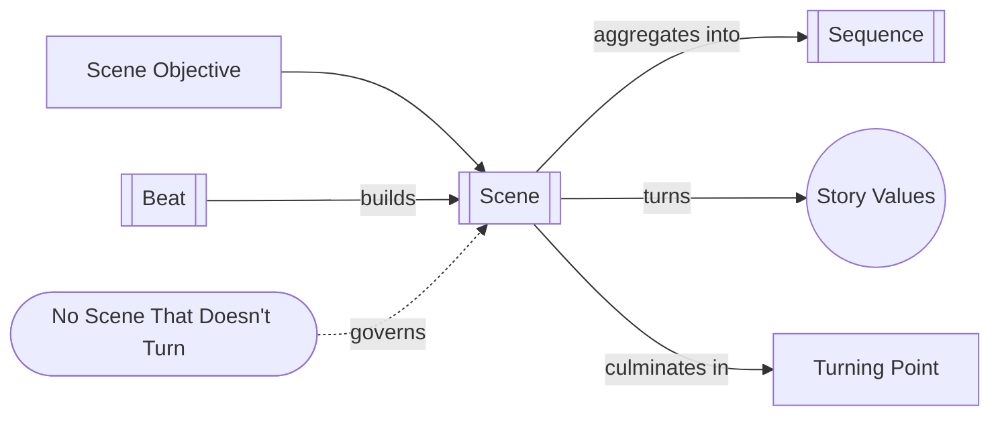

# Scene

> 中文版：[[wiki/zh/structures/scene|中文]]

## Definition

A Scene is a story in miniature: an action through conflict in more or less continuous time and space that pursues a [[scene-objective]], opens a [[the-gap|gap]], and turns the value-charged condition of a character's life. Ideally, every scene becomes a meaningful [[turning-point]].

## Concept Map

## Position in the Story Hierarchy

- **Above:** [[sequence]] — Scenes accumulate into larger waves of reversal.
- **Below:** [[beat]] — Beats compose scenes through changing action/reaction.
- **This level:** A unit of desire, conflict, gap, and value change.

## McKee's Argument

The scene is the fundamental building block of story. McKee expands the Chapter 2 definition in Chapters 10–11: a scene is not just continuous time and place but a dynamic of desire, unexpected reaction, and changed value. Each scene should be governed by a clear [[scene-objective]], internally articulated by [[beat|beats]], and driven toward a [[turning-point]] that gives the audience surprise, curiosity, and insight.

## How It Works

To evaluate a scene: (1) Define who wants what now. (2) Identify the value at stake at the opening. (3) Break the action into beats. (4) Compare closing value to opening value. (5) Locate the precise [[turning-point]]. A scene may shift across multiple locations and still remain one scene if it forms one continuous dramatic event.

## Film Examples

- McKee's "lovers break up" example — Multiple locations still form one scene because one value turns.
- **[[tender-mercies]]** — Quiet scenes still turn deep interior values.
- **[[casablanca]]** — The bazaar scene shows how subtext and objective fuse into a turn.

## Relationship to Other Concepts

- [[beat]] — Beats are the internal building blocks of scenes
- [[sequence]] — Scenes build into sequences; the capping scene is the Sequence Climax
- [[story-values]] — Each scene must turn at least one value
- [[turning-point]] — The moment where expectation and result split apart
- [[scene-objective]] — The scene's immediate desire line
- [[no-scene-that-doesnt-turn]] — The guiding principle for scene design

## Common Mistakes

McKee warns against scenes whose only purpose is exposition, scenes without a playable objective, and scenes that mistake activity for action. He also warns against confusing camera setups or location changes with true dramatic units.

## Sources

- *Story* Chapters 2, 10, and 11
