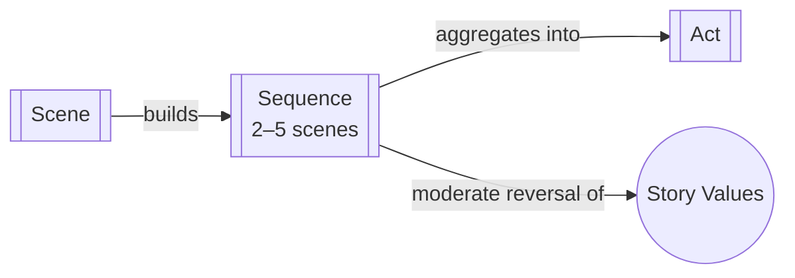

# Sequence

> 中文版：[[wiki/zh/structures/sequence|中文]]

## Definition

A Sequence is a series of scenes—generally two to five—that culminates with greater impact than any previous scene. The capping scene of a sequence delivers a more powerful, determinant change than individual scenes within it.

## Concept Map

## Position in the Story Hierarchy

- **Above:** [[act]] — Sequences build acts; the capping sequence delivers the act climax
- **Below:** [[scene]] — Scenes compose sequences through escalating value changes
- **This level:** A series of scenes that culminates in a Sequence Climax of greater magnitude than individual scene turns

## McKee's Argument

Sequences exist to organize scenes into meaningful progressions with escalating stakes. While individual scenes create minor but significant changes, the capping scene of a sequence delivers a more powerful, determinant change. McKee recommends titling each sequence to clarify its story purpose—e.g., "the getting the job sequence."

## How It Works

McKee illustrates with a three-scene sequence: (1) A woman prepares for a crucial job interview, turning from self-doubt to confidence; (2) She runs through Central Park at night, risking death and surviving; (3) At the party, she arrives bedraggled but her natural charm wins her the job. Each scene turns its own values (confidence, survival, social success), but the three combine into a sequence turning a larger value: NO JOB → JOB.

## Film Examples

- McKee's "getting the job" sequence — Three scenes (hotel, Central Park, party) build from self-doubt through mortal danger to social triumph, all in service of one overarching value: winning the job
- A sequence could be accomplished in a single scene but is expanded to dramatize inner character, relationships, and world

## Relationship to Other Concepts

- [[scene]] — Scenes are the building blocks of sequences
- [[act]] — Sequences build acts, with the most impactful sequence delivering the Act Climax
- [[story-values]] — A sequence's overarching value subordinates the individual scene values

## Common Mistakes

Writing sequences where the individual scenes don't build toward a greater value shift. If scenes within a sequence are disconnected or don't escalate, the sequence lacks dramatic momentum.

## Sources

- *Story* Chapter 2, "The Structure Spectrum"
