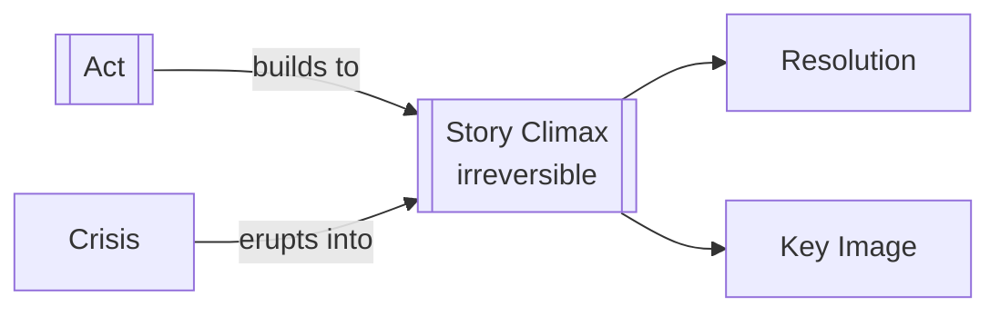

# Story Climax

> 中文版：[[wiki/zh/structures/story-climax|中文]]

## Definition

A Story Climax is the crowning event of the last act that brings about absolute and irreversible change. It is the action that explodes out of [[crisis]], answers the story's deepest question, and seals the final value shift of the work.

## Concept Map

## Position in the Story Hierarchy

- **Above:** None — it is the apex of the whole design.
- **Below:** [[act]] — Acts build toward it through escalating reversals.
- **This level:** The final action that expresses the story's irreversible meaning.

## McKee's Argument

Chapter 2 defines story climax structurally; Chapter 13 sharpens it aesthetically. The story climax is not merely the loudest moment but the most meaningful one. It may be outwardly huge or outwardly quiet, but it must complete the story's final value swing and feel irreversible in retrospect.

## How It Works

The climax usually follows a moment of decision: the protagonist confronts a [[dilemma]], chooses, acts, and the result cannot be taken back. Great climaxes often contain one last internal turn and may crystallize in a [[key-image]] that pulls the whole story together.

## Film Examples

- **[[star-wars]]** — Luke's final attack turns choice into irreversible victory.
- **[[thelma-louise]]** — The leap closes the story with absolute finality.
- **[[ordinary-people]]** — A quiet domestic action can still be overwhelming when it resolves meaning.

## Relationship to Other Concepts

- [[act]] — The climax crowns the final act.
- [[crisis]] — The climactic action normally erupts out of the crisis decision.
- [[resolution]] — Any remaining material follows it.
- [[key-image]] — The final image often concentrates its meaning.

## Common Mistakes

Common failures include mistaking spectacle for climax, ending on reversible change, or explaining the climax in dialogue rather than letting action carry meaning.

## Sources

- *Story* Chapters 2 and 13
