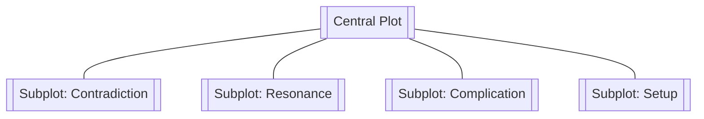

# Subplot

> 中文版：[[wiki/zh/structures/subplot|中文]]

## Definition
A **Subplot** is a secondary story woven into the Central Plot, driven by its own protagonist and desire, serving one of four functions: contradicting, resonating, complicating, or setting up the controlling idea of the Central Plot.

## Position in the Story Hierarchy
- **Above:** [[story-climax]] — Subplots must not overshadow the central climax.
- **Parallel:** [[act]] — Subplots occupy their own act architecture, often compressed.
- **Below:** [[scene]] — Built of the same scene/sequence units.

## McKee's Argument
Subplots are not filler. Each one must do work on the spine. The four legitimate uses:
1. **Contradiction** — Subplot's [[controlling-idea]] opposes the main one, giving the story dialectic weight.
2. **Resonance** — Subplot amplifies the main idea by variation.
3. **Complication** — Subplot creates antagonism that feeds the main line.
4. **Setup** — Subplot installs what the main line will later need (information, relationship, skill).

## Film Examples
- *Kramer vs. Kramer* — The father-son subplot resonates with the custody Central Plot.
- *Casablanca* — The Laszlo/letters-of-transit subplot complicates Rick's desire.

## Relationship to Other Concepts
- [[spine]] — Subplots must serve, not rival, the spine.
- [[inciting-incident]] — Subplots can have off-screen inciting incidents.
- [[controlling-idea]] — Subplots refract or challenge the central controlling idea.

## Common Mistakes
- Subplots that do none of the four jobs — mere decoration.
- Subplots more compelling than the Central Plot (structural imbalance).
- Abandoning a subplot without climax.

## Sources
- *Story* Chapter 9
