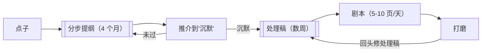

# 作家方法论（由内而外工作流）

> English: [[wiki/en/application/a-writers-method|English]]

## 概述
麦基的端到端项目流程。假定六个月从点子到最终打磨。该方法的设计是**把对白推迟到事件、价值、潜文本都经受住压力测试之后**；当对白终于到来时，它是人物专属的、能承重的。

## 步骤
1. **资料与世界搭建**分立在文件柜里。传记、历史、词汇。供给提纲而不让提纲臃肿。
2. **分步提纲**——3x5 卡、每幕一摞。见[[step-outline]]。
3. **推介**——对聪敏而敏感的听众做十分钟口述，直至讲述能让房间沉默。
4. **处理稿**——每卡扩为一段现在时动作 + 完整潜文本；**无对白**。见[[treatment]]。
5. **剧本**——把处理稿的描写转为银幕描写，再加对白。对白此时才自由呼吸，带上人物专属嗓音。
6. **打磨**——某句或某场不对时，**不要**改对白——回到处理稿修铺垫、调回报，再回到剧本。

## 检查清单
- [ ] 不要一开始就写场景描写＋对白。
- [ ] 分步提纲在卡片上，按幕分摞。
- [ ] 推介测试至"沉默"。
- [ ] 60–90 页、零对白、全潜文本的处理稿。
- [ ] 处理稿之后剧本每天 5–10 页。
- [ ] 打磨走处理稿，而不是直接改纸面。

## 基于
- 由内而外（[[writing-from-the-inside-out]]）在项目层面的应用。
- 执行"分步提纲 → 处理稿（[[treatment]]）→ 剧本"的链条。
- 遵守无声剧本（[[silent-screenplay]]）教义：对白是**最后**一层。

## 来源
- 《故事》第19章
