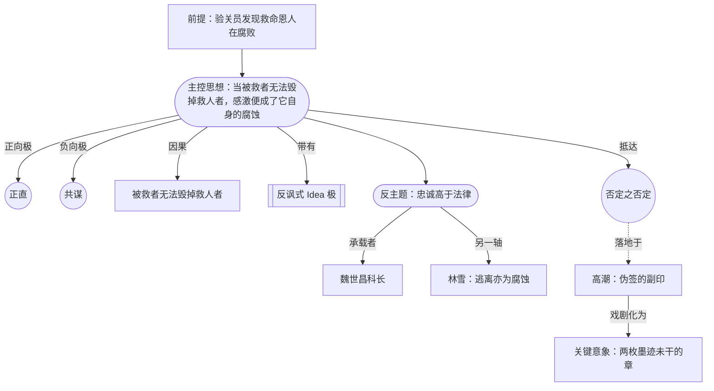

# 主控思想案例研究：第三天

> English: [[wiki/en/application/controlling-idea-the-third-day|English]]

## 概述

一份[[controlling-idea|主控思想（Controlling Idea）]]锻造过程的实操案例，应用于一部长片体量的罪案 / 体制类正剧。该项目《第三天》设定于 1989 年秋的大连海关；主人公于敏是新入职的年轻验关员，她发现自己的上级——文革年间救过她家的恩人——长期经营着一张走私保护网。本案例展示了**反讽式（ironic）**主控思想是如何被建构的（而不是被宣告的），其[[idea-vs-counter-idea|主题与反主题（Idea vs. Counter-Idea）]]矩阵中如何安置具有说服力的承载者，以及如何抵达[[negation-of-the-negation|否定之否定（Negation of the Negation）]]。

## 主控思想句

> **当被救者无法毁掉救人者，感激便成了它自身的腐蚀。**

标记：**反讽（ironic）** · **闭合（closed）**。

该句符合麦基对[[controlling-idea]]的全部要求（第 6 章）：

- **命名了价值**于其闭合极：*被腐蚀的感激*——正直这一价值被本应支撑它的德性（感激）所反转。
- **命名了因果**且通过行为：*被救者无法毁掉救人者*——一个可在场景中戏剧化的行为命题。
- **以高潮为形**：句子描述的是发生在[[climax|高潮（Climax）]]的事件（伪造的副印盖在篡改的舱单上），而非[[inciting-incident|激励事件]]或中段。
- **可在画面上证伪**：观众如果只看到高潮 + 结局——于敏摁下两枚章、18:00 汽笛响起时空手离场、六个月后她在新来年轻验关员一份干净报告上副签——便能在没有台词解释的前提下接收到主控思想。
- **是论辩，不是说教**：故事中没有任何角色用台词说出主控思想本身。
- **反主题鲜活**：见下方矩阵。

## 主题 / 反主题矩阵

| 极 | 陈述 | 承载者 | 在高潮中证明它的行为 |
|---|---|---|---|
| **主题** | 当被救者无法毁掉救人者，感激便成了它自身的腐蚀。 | 于敏（主人公；以行动践行腐蚀） | 在自己印章下提交伪造舱单；空手走出 |
| **反主题** | 对救过你的人保持忠诚，是高于法律的最高道德行为。 | 魏科长（持续、有说服力——从不哀求，从不滑落为反派） | 把于敏父亲 1969 年写给他的唯一一封信讲给她听：*「我不会感谢你，因为感谢会把我置于你的债下；我只会做我的工作。」* 他**展示**这一道德格局，而不**要求**她沉默。反主题被**具身**而非论辩。 |
| **[[negation-of-the-negation\|否定之否定]]** | 那种毁掉被救者的感激，被所有看到它的人——包括被救者本人——误认为是最高的德性。 | 于敏在结局尾声中——六个月后副签新人验关员一份干净报告；腐蚀如今正通过她的手延续 | 结局尾声的最后画面：两枚并排的章，构图与高潮完全相同；新来的年轻验关员模仿于敏摁印台的角度。系统在自我复制。 |

## 这个 Idea 禁止什么、要求什么

麦基的纪律（第 6 章）：一旦锁定，主控思想必须**禁止**某些情节走向、**要求**另一些。这正是让 Idea 成为一种可工程化的约束——而非一句口号——的关键。

**禁止：**

1. 于敏不能干净地胜利——职业胜利即腐蚀本身。
2. 魏不能是单薄的反派——单薄的反派会把反讽塌陷为[[melodrama|苦情剧（melodrama）]]。
3. 走私网不能由外部介入者揭破——困局必须是她的。
4. Idea 不能由台词陈述——观众必须从印章上读出。
5. 三天的时钟不能延长——时钟即对抗。
6. 高潮之后不能有回弹场。

**要求：**

1. 一场展示魏持续道德严肃性的[[scene|场景（scene）]]——到[[crisis|危机（Crisis）]]时，观众必须希望他被保住，违法亦可。
2. 一场为于敏提供了干净退路、而她拒绝的场景——即[[false-ending|假结局（False Ending）]]。
3. 危机作为**认识时刻**（按第 13 章对[[crisis|Crisis]]的纪律），而非斟酌时刻。
4. 高潮在体量上**小**、在后果上**总**。
5. 一个**延续**的结局画面——[[key-image|关键意象（Key Image）]]在尾声中被重新构图。

## 此案例所示的方法

1. **反讽式 Idea 需要一个值得对手位的反主题承载者。** 本案展示了：当反主题由一个具备道德严肃性、从不哀求的人物（魏）所承载时，[[principle-of-antagonism|对抗原则（Principle of Antagonism）]]即被满足，且无需诉诸反派化。交叉引用：[[forces-of-antagonism|对抗力量]]。
2. **「否定之否定」是经由主人公的最高德性、而非最低劣行落地的。** 于敏的职业精度（她干净的章）正是让伪造的副印**完美**的条件。Idea 用主人公的强项反过来对付她——这是麦基反讽中的标志性一着。
3. **Idea 的价值极与因果项必须双双在高潮中可见。** 「两枚章」的关键意象同时承载二者：*伪造的章*（价值），和*伪造的方向*（因果：她为他而签，而非反对他而签）。
4. **Idea 在下游各处约束场景工作。** 此 Idea 禁止了"北京调查员介入"、"法庭裁决"、"公开问责"三种作家会本能伸手去拿的结构性退路。在 Idea 锁定的那一刻就把它们关闭，[[spine|故事脊椎（spine）]]即被强制朝危机困境收拢。

## 来源

- 麦基，*Story* — 第 6 章（结构与意义）、第 13 章（危机·高潮·结局）、第 14 章（对抗原则）。亦见 [[chapter-06-structure-and-meaning]]、[[chapter-13-crisis-climax-resolution]]、[[chapter-14-the-principle-of-antagonism]]。
- 项目工件（在 `drafts/the-third-day/` 下）：`controlling-idea.md`、`crisis-climax-audit.md`、`antagonism-test.md`。这些工件由本项目在 `.claude/agents/` 下定制的代理编队产出。
- 可比的反讽极标本：《唐人街》（*Chinatown*, 1974）、《窃听风暴》（*The Lives of Others*, 2006）、《一个英雄》（*Ghahreman / A Hero*, 2021）。
