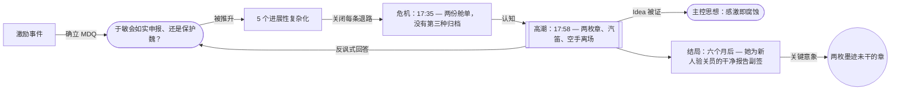

# 危机-高潮案例研究：第三天

> English: [[wiki/en/application/crisis-climax-the-third-day|English]]

## 概述

一份故事末段审计——[[crisis|危机（Crisis）]]·[[story-climax|高潮（Climax）]]·[[resolution|结局（Resolution）]]——的实操案例，应用于一部带**反讽式**主控思想的长片体量罪案 / 体制类正剧（参见 [[controlling-idea-the-third-day|主控思想案例：第三天]]）。本页演示：当故事脊椎、群像、主控思想三份契约均以纪律锻造时，"末段十二点审计"的每一项是如何被满足的。它也展示了本案的**异乎寻常之处**：一个以**隐瞒**而非揭露为核心的高潮，一个以反讽方式被回答的[[major-dramatic-question|大戏剧问题（MDQ）]]（主人公"赢"是因为她**变成了**那场腐蚀），以及一个其[[key-image|关键意象]]为高潮构图**复现**的结局。

## 危机的两难（承重测试）

按第 13 章，[[crisis|危机（Crisis）]]是一个真正的[[dilemma|两难（dilemma）]]——在**两个不可调和的善**之间、或在**两个恶中较轻者**之间做出不可化约的抉择。检验法：*移除任何一只角，另一只角的意义随之消亡*。

| 选项 A — 提交真实舱单 | 选项 B — 提交伪造舱单 |
|---|---|
| 走私网就此终结。 | 走私网继续运作。 |
| 魏被揭破；他失去职业生涯，可能失去自由。 | 魏被保住；他的职业与他在家中的道德地位都得以延续。 |
| 于敏的职业正直被保住。 | 于敏的正直在一次签字中被伪造覆盖。 |
| 救命故事（家族二十年的身份基底）被毁。 | 救命故事被保住——以"于敏成为它的下一章"的方式。 |
| 于敏成为"毁掉救她家的人的女儿"。 | 于敏成为魏。 |

**测试通过**。每一项代价都不可替代。移除 A，B 不再是道德抉择，只是腐蚀的漂移；移除 B，A 不再是抉择，只是不可避免的路。

这一两难是由进展性复杂化（PC）所**创造**的——它们逐一关闭每一条其他出路：

- **PC1** 关闭 *制度性退路*（林雪："办公室早就知道；不知道才是规矩。"）
- **PC2** 关闭 *把家庭代价当作可承受的退路*（母亲在海关门口无意中把救命故事再次双倍地讲给魏听）。
- **PC3** 关闭 *直接对峙*（魏拒绝给她她来索取的对白；他签了她的推荐函，并仅有一次地用她的小名喊她）。
- **PC4** 关闭 *逃离*（林雪的天津调动是[[false-ending|假结局（False Ending）]]；她那句"逃的是自己"揭示，提供给于敏的退路本身就是林雪当年选择的腐蚀）。
- **PC5** 关闭 *时间线*（海关稽查处官员在 14:00 当面询问过去 48 小时是否有未提交的报告；18:00 的下班汽笛成为最后期限）。

到危机时刻 17:35，已不存在第三种归档。主人公的聪明在前面被预先消耗光了；这个陷阱是道德陷阱，不是程序陷阱。

## 高潮——以隐瞒为必备场景

[[genre-conventions|类型]]在此为体制 / 政治罪案正剧，叠加一个[[mixing-genres|次要]]的惩罚式情节。一个类型常规的罪案高潮提供**揭露**；本故事的高潮提供**隐瞒**——于敏在自己的印章下提交伪造舱单，从魏先前签好的推荐函上取来纸样，伪造他的副印。18:00 的汽笛在第二枚章落下时鸣响。

这是一处**已付清成本的反常规**（见 `drafts/the-third-day/genre-contract.md` §8）：

- *代价*：丧失了类型的经典宣泄；观众可能感到正义未得伸张。
- *补偿*：隐瞒被处理得**清晰可读**——观众实时看到伪造发生，连墨迹未干的细节都看见；结局尾声中关键意象的复现进一步**加深**而非散去这份"缺席的宣泄"。

该高潮满足[[story-climax|高潮]]的全部四项要求：

1. **由危机决定所引发**——无[[coincidence|偶合]]、无外部解救。因果链：PC5 → 危机时刻的认知 → 高潮行动，无断裂。
2. **遵守类型契约**——满足"印章落下"的必备场景，尽管它把"揭露"惯例倒转成了"隐瞒"。
3. **[[inevitable-and-unexpected|必然且出人意料]]**——价值翻转早被观众预见（他们知道她不会如实申报）；*形式*出人意料（"第三份文件"——一个由人 A 伪造人 B 副印的具体物件——是观众没预见到的具体形态）。
4. **MDQ 的兑现**——*于敏会如实申报舱单、终结魏的走私网，还是为了保住魏而成为腐蚀的新代理？* 答案以反讽方式给出：她**保住**了他——做法是**把那场腐蚀承接到自己身上**。这个答案在"第二章 + 汽笛"的同一时刻送达观众。

## 为什么主控思想是被戏剧化、而不是被陈述的

一个用台词"陈述"主控思想的高潮，是最便宜的一种交付（第 6 章）。本案的高潮规避了这个失败：

- **价值极**（被腐蚀的感激）由**伪造的章**戏剧化——一个人 A 造的人 B 的签名，正是体制语法中"腐蚀"的字面定义。
- **因果项**（被救者无法毁掉救人者）由伪造的**方向**戏剧化——于敏为魏而签，而非反对魏而签；她没有拒绝他的庇护（那会以另一种方式毁掉他），也没有揭露他（那会以又一种方式毁掉他）；她**把他的行为承接到自己身上**。
- **弧光位置**（负向弧光在主人公的**最高职业德性**那一极落地）由伪造的**精度**戏剧化——印章被精确地摁下；腐蚀**胜任**。观众在这份精度里读到反讽。

没有人物用台词说出 Idea。观众在印章的时间序列里读它：笔 → 章 → 章 → 汽笛 → 空手走出。

## 结局——以复现为关键意象

按第 13 章对[[resolution|结局]]的纪律：余波结清，每条仍在活动的副线被回答，[[key-image|关键意象]]被交付。本案的结局**简短**——单一场景外加一个跳切，发生在高潮六个月后。

关键意象**复现**了高潮的构图：

- *高潮构图*：荧光下、三楼办公室同一张桌面、单页舱单、并排两枚章——于敏的章和伪造的魏的副印；第二枚章的墨迹未干。
- *结局构图*：同一道荧光、同一张桌、单页报告、并排两枚章——于敏的章和新来年轻验关员的干净副印；新人盯着于敏的印台角度，模仿。

两幅画面**视觉上完全相同**。变化在于于敏的**视线**——她看的不再是自己的手，而是新人的手。观众从视线、而非从画面里读出区别。系统在自我延续；下一个验关员正在变成于敏，正如于敏当年变成了魏。

这就是[[negation-of-the-negation|否定之否定]]的视觉落地：腐蚀被所有看到它的人误认为德性，包括正在被训练进入它的下一个人。

## 此案例所示的方法

1. **真正的两难是被对抗力量创造出来的，不是被作者宣布出来的。** 五个 PC 关闭五条不同的退路。到危机时，主人公的聪明已被预先消耗；选择是道德的、不是策略的。这是**两难**与**艰难抉择**的分界。
2. **反常规的高潮要靠"清晰可读"来为自己付清代价。** "以隐瞒代揭露"作为高潮，可以替代"以揭露作高潮"，前提是观众以颗粒级清晰度看到隐瞒发生。模糊或场外的隐瞒会击穿类型契约。
3. **即使脊椎是大情节（archplot），高潮也能给出对 MDQ 的反讽式回答。** MDQ 被回答了（是的，她保住了他；*而且*她变成了腐蚀——这个"而且"就是反讽）。因果完整无缺；只有价值电荷的解读发生倒转。
4. **关键意象活在结局对自身的复现中，而不止于一帧。** 跨幕反复出现并在结局尾声中**对自身重新构图**的关键意象，比只在高潮交付一次的意象积累出更多意义。交叉引用：[[image-systems|意象系统]]。

## 来源

- 麦基，*Story* — 第 13 章（危机·高潮·结局）是承重章；第 6 章（结构与意义）提供"Idea 戏剧化"的纪律；第 14 章（对抗原则）提供"两难"的检验。见 [[chapter-13-crisis-climax-resolution]]、[[chapter-06-structure-and-meaning]]、[[chapter-14-the-principle-of-antagonism]]。
- 项目工件（在 `drafts/the-third-day/` 下）：`crisis-climax-audit.md`、`spine.md`、`act-design.md`、`key-image.md`、`antagonism-test.md`。这些工件由本项目在 `.claude/agents/` 下定制的代理编队产出。
- 反常规高潮的标本：《唐人街》（*Chinatown*, 1974，"失败式高潮"）、《窃听风暴》（*The Lives of Others*, 2006，"涂黑而非揭露式高潮"）。
