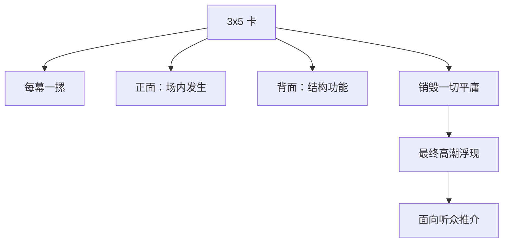

# 分步提纲（Step-Outline）

> English: [[wiki/en/application/step-outline|English]]

## 概述
**分步提纲**是把整部故事分步骤地写在索引卡（3x5）上的工具：每张卡用一两句话写明"此场发生了什么、如何建立、如何转折"。卡背注明该步在整体设计中的功能（激励事件的铺垫、幕高潮……）。一叠＝一幕。

麦基让作家在提纲里**住几个月**——典型是六个月剧本周期中的前四个月——因为 90% 的发明都只是平庸，必须被舍弃以寻找质量。

## 步骤
1. **燃料另放**。人物传记、世界历史、主题笔记、图像、词汇放进文件柜。保持提纲轻盈。
2. **每场戏一张卡**。一两句。"他进屋以为妻子在家，却发现她留下纸条已永远离去。"
3. **背面标功能**。激励事件铺垫？激励事件？幕中高潮？幕高潮？副线反转？
4. **生成与销毁**。每一场都草拟多种写法。凡未达到这摞水平的场景，**把想法**本身扔掉。相信自己才华的作家，知道灵感无限。
5. **最后发现高潮**。在提纲阶段发现故事高潮，再从那里反向修整前面的戏。
6. **推介给人**。不是读剧本；是十分钟的口头讲故事。盯着对方的眼睛。准备就绪的标志是：**沉默**——听者带着愉悦闭口不言。

## 检查清单
- [ ] 每场戏落到一张卡上，一两句话。
- [ ] 按幕分摞；背面写功能。
- [ ] 激励事件、幕高潮、故事高潮已被指认。
- [ ] 副线另有卡片自成一线。
- [ ] 提纲能在十分钟内口述：勾住、维持、打动听众。
- [ ] 在此之后方可进入处理稿（[[treatment]]）。

## 基于
- 由内而外（[[writing-from-the-inside-out]]）在项目层面的应用。
- 每张卡是一次故事事件（[[story-event]]），指向一次转折点（[[turning-point]]）。
- 在作家方法论（[[a-writers-method]]）中位于处理稿之前。

## 来源
- 《故事》第19章
