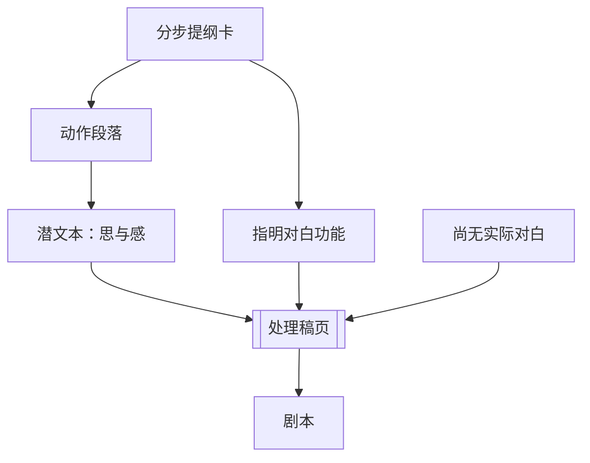

# 处理稿（Treatment）

> English: [[wiki/en/application/treatment|English]]

## 概述
**处理稿**是把分步提纲（[[step-outline]]）里的每一场戏扩写为一段**现在时**、**逐刻推进**的动作描写——**带潜文本**、**不写对白**。长片的典型长度：双行距 60–90 页。片厂时代的处理稿可达 200–300 页，为的是"没有一个时刻未被思考"。

## 步骤
1. **以提纲为支架**。每张卡变成一段文字。
2. **用现在时描写动作**。"Jack 走进来，把公文包甩到 Chippendale 椅子上……"
3. **指明'说什么'，不写对白**。"他想让她这样做；她拒绝。" 由潜文本承载，不是由台词承载。
4. **写出潜文本**。言行之下真正的思与感。"他终于独处了，真好。把公文包砸上她心爱的椅子。她会为划痕恨他——今天他管不了。"
5. **自由重工**。整体设计不变（每次口述都成立），但个别场景可删、可加、可重排。资料与想象永不停歇。
6. **处理稿'活'了再进入剧本**。那时每一刻已经有了文本和潜文本；剧本就是"描写 + 对白"，每天 5–10 页。

## 检查清单
- [ ] 每张卡扩为现在时段落。
- [ ] 每一节拍都明确写出潜文本；不键入对白。
- [ ] 长片典型 60–90 页。
- [ ] 转折点在纸面上可读。
- [ ] 提纲之外的资料视需要汇入。
- [ ] 唯有此后进入剧本；对白在最后一阶段加入。

## 基于
- 分步提纲（[[step-outline]]）的扩写。
- 由内而外（[[writing-from-the-inside-out]]）在场景层面的应用。
- 把文本与潜文本（[[text-and-subtext]]）在每一刻显化。

## 来源
- 《故事》第19章
