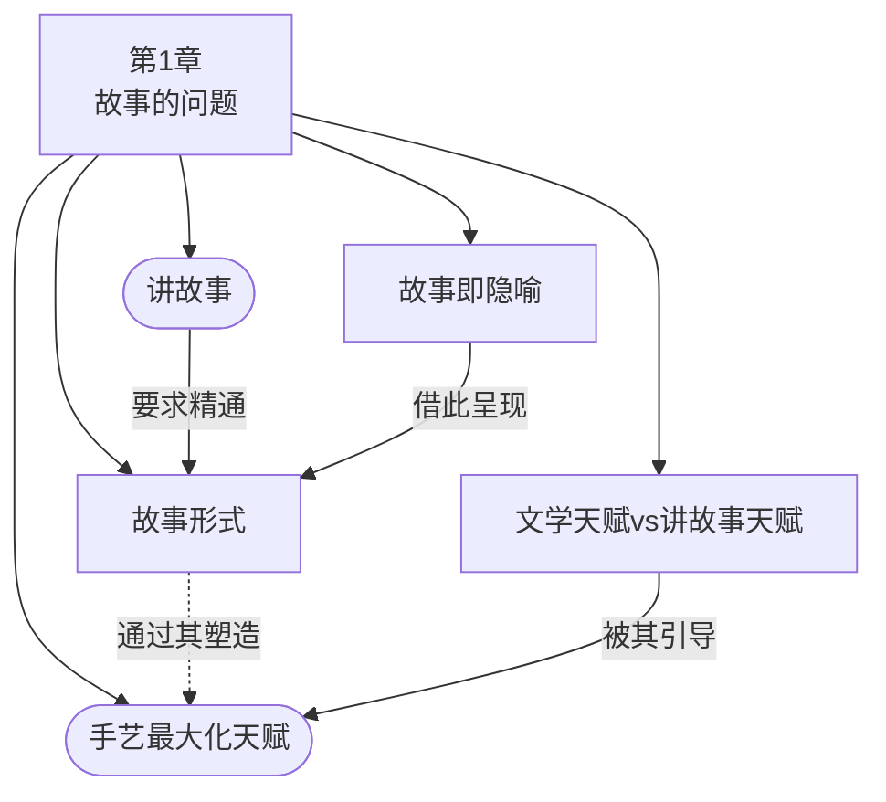

# 第1章：故事的问题

> English: [[wiki/en/chapters/chapter-01-the-story-problem|English]]

## 摘要

麦基开篇即提出诊断：讲故事的艺术正在衰落。尽管人类对故事有着无尽的渴求——肯尼斯·伯克称之为"生活的装备"——但讲故事的整体质量却在持续下滑。好莱坞每年制作数百部电影，但大多平庸。一个难以接受的事实是：银幕上呈现的，已经是近年来最好的写作成果了，并非片厂对隐藏天才的漠视。

根本原因在于手艺（Craft）的流失。有抱负的编剧们急于动笔，却不先学习故事构成的原理，正如一个人试图不学音乐理论就去创作交响曲。大学教育已经从教授故事的内在原则（欲望、对抗、转折点、危机、高潮）转向了外在的文学理论（语言、符码、文本）。好莱坞旧日的学徒制也已不复存在。而共享价值观的深层侵蚀更使讲故事比以往任何时候都更加艰难。

麦基确立了故事设计——而非对白、描写——才是编剧首要的创作任务，占据了75%以上的劳动。他区分了[[story-form|故事形式]]（普遍的、超越时代的故事形态）与公式（简化的配方），坚持认为编剧必须把握形式而不是将其简化为公式。他指出，[[story-as-metaphor|故事即比喻]]是根本性的认知：故事不是对现实的逃避，而是探寻现实的载体。

最后，麦基区分了两种天赋：文学天赋（将语言转化为富有表现力的形式）和故事天赋（将生活转化为有意义的体验）。前者常见，后者稀少。两者都不可或缺，但[[craft-maximizes-talent|手艺使天赋最大化]]——没有手艺的天赋，就像没有引擎的燃料，虽然燃烧猛烈，却一事无成。

## 章节概念图

## 引入的核心概念

- **[[story-as-metaphor]]**（故事即比喻）— 故事不是对现实的逃避，而是对生活的隐喻，从日常中提炼本质
- **[[story-form]]**（故事形式）— 所有故事背后普遍的、超越时代的形式；形式不等于公式
- **[[literary-talent-vs-story-talent]]**（文学天赋与故事天赋）— 编剧需要的两种截然不同且互不相关的天赋
- **[[craft-maximizes-talent]]**（手艺使天赋最大化）— 手艺是将天赋转化为讲故事力量的引擎

## 关键案例

- **[[tender-mercies]]**（《温柔的怜悯》）— 与《夺宝奇兵》并列，证明截然不同的电影共享普遍的故事形式
- 多部电影作为故事多样性的例证：《唐人街》《汉娜姐妹》《迷魂记》《八部半》《罗生门》《卡萨布兰卡》

## 麦基的核心论点

讲故事的危机不是由片厂把关者或天赋匮乏造成的——而是由手艺的流失所致。编剧必须像音乐家学习音乐理论那样严格地学习故事构成的原理。目标是"好故事讲得好"，而实现这一目标需要掌握[[story-form|故事形式]]、理解[[story-as-metaphor|故事即比喻]]，并发展手艺来将天赋导入艺术之中。

## 与其他章节的联系

- 引出[[chapter-02-the-structure-spectrum|第2章：结构谱系]]：确立了故事具有普遍形式之后，第2章开始通过[[structure|结构]]、[[story-event|故事事件]]以及[[beat|节拍]]、[[scene|场景]]、[[sequence|序列]]、[[act|幕]]的层级关系来定义这种形式

## 重要引文

- "Story is not a flight from reality but a vehicle that carries us on our search for reality, our best effort to make sense out of the anarchy of existence."
  - 译文："故事并不是对现实的逃避，而是一种载体，承载着我们去追寻现实、尽最大的努力挖掘出混乱人生的真谛。"
- "Talent without craft is like fuel without an engine. It burns wildly but accomplishes nothing."
  - 译文："只有天赋而没有手艺，就像只有燃料而没有引擎。它能像野火一样暴烈燃烧，但结果却是徒劳无功。"
- "Story is metaphor for life."
  - 译文："故事是生活的比喻。"
- "Form does not mean 'formula.'"
  - 译文："形式并不意味着'公式'。"
