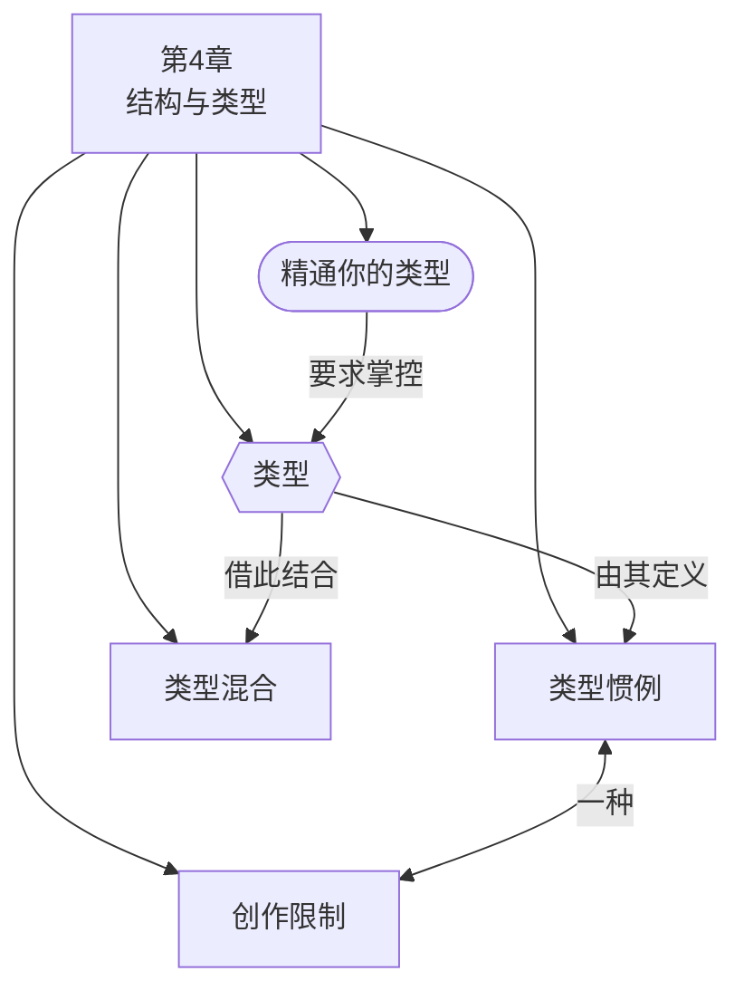

# 第4章：结构与类型

> English: [[wiki/en/chapters/chapter-04-structure-and-genre|English]]

## 摘要

麦基将类型（Genre）呈现为继背景之后的第二大结构性约束。他编目了25种电影类型——从爱情故事和恐怖片到艺术电影——认为每个作者都在类型中工作，无论他们是否承认这一点。观众作为"类型专家"走进每部电影，携带着从一生观影经历中学到的期望。作者必须满足这些期望，同时引导它们走向新鲜、出人意料的时刻。

类型惯例（Genre Conventions）——定义每种类型的具体背景、角色、事件和价值——不是障碍而是创作催化剂。麦基将第3章的[[creative-limitation|创作限制]]原则加以延伸：正如诗人的韵律方案可以激发意想不到的意象，类型惯例迫使作者在已知模式中找到原创的解决方案。挑战在于"保持惯例但避免陈词滥调"。

本章考察了类型如何随社会演变（西部片、心理剧、爱情故事各自经历了数十年的转变），类型如何混合以创造新的共鸣，以及对类型的精通如何为编剧漫长的马拉松提供持久力。麦基最后总结说"艺术与商业成功之间没有必然矛盾"——希区柯克已经明确证明了这一点。

## 章节概念图

## 引入的核心概念

- **[[genre]]**（类型）— 25种电影类型及其子类型，按主题、背景、角色、事件和价值分类
- **[[genre-conventions]]**（类型惯例）— 定义各个类型的具体背景、角色、事件和价值
- **[[mixing-genres]]**（类型混合）— 结合类型以创造更丰富的意义、角色和情感变化
- **[[creative-limitation]]**（创作限制）— 延伸至类型领域：惯例是故事讲述者"诗篇"的韵律方案

## 关键案例

- **[[chinatown|唐人街]]**（*Chinatown*）— 打破谋杀悬疑片的惯例，让凶手逍遥法外，反映了1970年代美国对腐败的觉醒。一部改写了自身类型的经典之作。
- **《夺宝奇兵》**（*Raiders of the Lost Ark*）— 对英雄在恶棍手下惯例的新鲜执行
- **《一条叫旺达的鱼》**（*A Fish Called Wanda*）— 通过被压扁的小狗场景阐释喜剧惯例"没人真正受伤"
- **《西雅图不眠夜》**（*Sleepless in Seattle*）— 将爱情故事改造为"渴望故事"，将男女主角的相遇推迟到高潮

## 麦基的核心论点

类型不是与艺术分离的商业考量——它是一切叙事的结构基础。观众是类型专家；作者必须超越这种专业性。类型惯例是在被掌握时激发原创性的创作限制，而类型随社会演变。掌握类型的作者可以引导观众经历丰富的惯例变奏，给予他们不仅仅是他们所期望的，更是他们无法想象的。

## 与其他章节的联系

- 承接[[chapter-03-structure-and-setting|第3章]]：展示类型是超越背景的第二层创作限制
- 将第3章引入的[[creative-limitation|创作限制]]原则延伸到类型惯例领域
- 回应[[chapter-02-the-structure-spectrum|第2章]]：[[the-story-triangle|故事三角]]的分类（大情节、小情节、反情节）映射到类型——艺术电影本身就是一种类型，以极简主义和反结构为子类型

## 重要引文

- "The audience is already a genre expert. It enters each film armed with a complex set of anticipations learned through a lifetime of moviegoing."
- 译文："观众已经是类型专家。他们带着从一生观影经历中习得的复杂期望走进每一部电影。"
- "Genre conventions are the rhyme scheme of a storyteller's 'poem.' They do not inhibit creativity, they inspire it."
- 译文："类型惯例是故事讲述者'诗篇'的韵律方案。它们不是抑制创造力，而是激发创造力。"
- "There is no necessary contradiction between art and popular success, nor a necessary connection between art and Art Film."
- 译文："艺术与商业成功之间没有必然矛盾，艺术与艺术电影之间也没有必然联系。"
