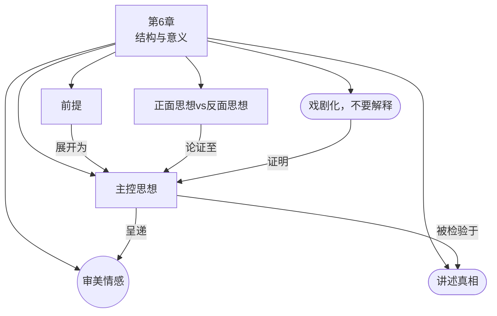

# 第6章：结构与意义

> English: [[wiki/en/chapters/chapter-06-structure-and-meaning|English]]

## 摘要

麦基探索故事如何创造意义。他从**审美情感**（Aesthetic Emotion）开始——艺术所产生的、生活中罕有的思想与感情的同步交汇。在生活中，思想和情感是分离的；在艺术中，它们融合为一。故事是随意创造这种融合的工具。

两个概念框定了创作过程：**前提**（Premise，开放性的"如果……会怎样？"式灵感）和**主控思想**（Controlling Idea，通过最后一幕高潮所表达的故事终极意义）。主控思想有两个组成部分：**价值**（高潮时的正面或负面电荷）加上**原因**（产生这种变化的主要原因）。它必须能用一个句子表达，描述生活如何以及为何从开头到结尾发生了变化。

麦基接着揭示了推动故事走向主控思想的引擎：**正面思想与反面思想**的辩证法（Idea vs. Counter-Idea）。递进通过在正面和负面电荷之间动态移动来构建。每个序列论证一方，然后另一方，直到在危机（Crisis）处正面碰撞，一方在高潮中获胜。

本章将作者分为**理想主义者**（正面结局）、**悲观主义者**（负面结局）或**反讽主义者**（正负交织的结局，表达生活的双重本质）。麦基警告不要**说教主义**——通过狂热的布道扼杀艺术——并总结说艺术家唯一的责任是讲述真相。

## 章节概念图

## 引入的核心概念

- **[[aesthetic-emotion]]**（审美情感）— 思想与感情的同步交汇；艺术能提供而生活无法提供的东西
- **[[premise]]**（前提）— 开启创作过程的开放性灵感（"如果……会怎样？"）
- **[[controlling-idea]]**（主控思想）— 故事不可磨灭的意义：价值+原因，通过高潮表达
- **[[idea-vs-counter-idea]]**（正面思想vs.反面思想）— 辩证引擎：正面和负面电荷通过序列辩论直至高潮

## 关键案例

- **[[chinatown|唐人街]]**（*Chinatown*）— 悲观主义主控思想："邪恶获胜，因为它是人性的一部分"
- **肮脏的哈里**（*Dirty Harry*）— "正义获胜，因为主人公比罪犯更暴力"——主控思想指导什么是恰当的（暴力）vs. 不恰当的（福尔摩斯式推理）
- **库布里克反战三部曲**（《光荣之路》、《奇爱博士》、《全金属外壳》）— 大师级平衡：如此深入地探索反面思想（人类热爱战斗），使反战信息变得有说服力而非说教

## 麦基的核心论点

大师级叙事者从不解释——他们戏剧化。故事的意义必须通过其事件的动态来证明，而非通过对白来断言。主控思想从高潮中浮现；故事告诉你它的意义，你不能向故事口授意义。创作过程在辩证的辩论中交替正面思想和反面思想，直到一方在高潮中获胜。艺术家唯一的责任是真相："在一个充满谎言和骗子的世界里，一部诚实的艺术作品永远是一种社会责任行为。"

## 与其他章节的联系

- 承接[[chapter-05-structure-and-character|第5章]]：揭示和改变角色的高潮同时也表达了故事的主控思想
- 承接[[chapter-02-the-structure-spectrum|第2章]]：[[story-values|故事价值]]现在被赋予了精确的功能——它们构成主控思想的价值组成部分
- 延伸[[chapter-04-structure-and-genre|第4章]]：类型决定了审美情感的种类以及高潮时典型的价值电荷

## 重要引文

- "Life on its own, without art to shape it, leaves you in confusion and chaos, but aesthetic emotion harmonizes what you know with what you feel."
- 译文："生活本身，没有艺术来塑造它，只会让你陷入混乱和困惑，但审美情感将你所知道的和你所感受的调和在一起。"
- "STORYTELLING is the creative demonstration of truth. A story is the living proof of an idea, the conversion of idea to action."
- 译文："叙事是真理的创造性展示。故事是思想的活证据，是思想到行动的转化。"
- "In a world of lies and liars, an honest work of art is always an act of social responsibility."
- 译文："在一个充满谎言和骗子的世界里，一部诚实的艺术作品永远是一种社会责任行为。"
