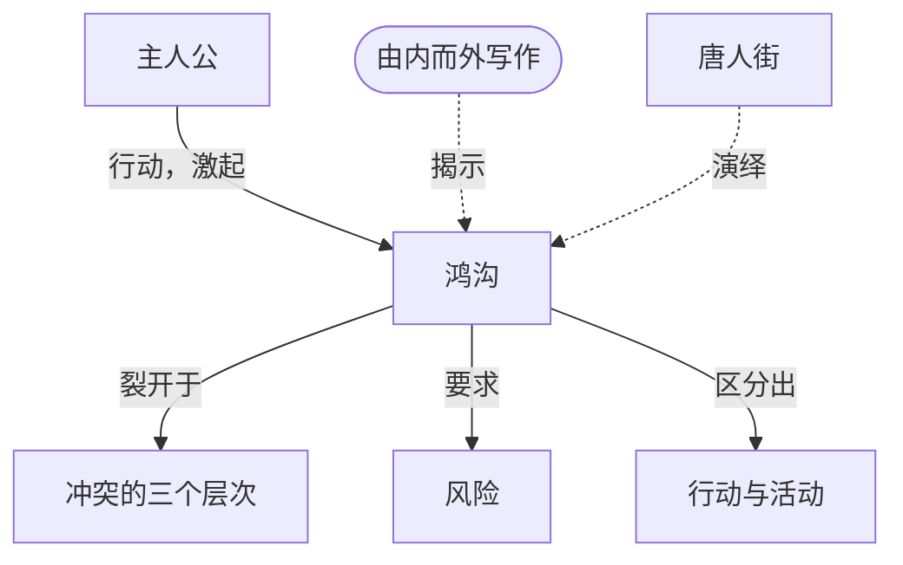

# 第7章：故事的实质

> English: [[wiki/en/chapters/chapter-07-the-substance-of-story|English]]

## 摘要
麦基在第二部分"故事诸要素"开篇提出一个根本问题：故事的原料是什么？不是文字。语言只是媒介之一。故事的**实质**是**鸿沟**——人物采取行动时的预期与世界实际反馈之间的裂缝。故事就建筑在这条**或然与必然**之间、**主观自我与客观世界**之间的断层线上。

要抵达这条鸿沟，作家必须**由内而外**写作，借助斯坦尼斯拉夫斯基的"神奇的假使"——"如果我是这个人物，身处此情此境，我会怎么做？"——并辩证地追问："那么这件事的对立面是什么？"本章引入[[protagonist]]（主人公）作为故事实质的枢轴：一个有意志的人物，拥有自觉欲望（可能还有与之矛盾的潜意识欲望），有能力将追求推至人类极限，且与观众建立共情纽带。人物的一切行动，从他自己的视角看都是**最小的、保守的**；只有当现实拒绝配合时，鸿沟才裂开。每一次鸿沟的开裂都抬高赌注，抬高[[risk]]（风险），驱动故事走到尽头。

## 引入的核心概念
- **[[the-gap]]**（The Gap）— 预期与结果之间的裂缝，故事能量的核。
- **[[protagonist]]**（Protagonist）— 有意志的人物，拥有自觉（及可能的潜意识）欲望，有能力将追求推至极限，并与观众建立共情。
- **[[levels-of-conflict]]**（Levels of Conflict）— 对抗的三层同心圆：内心、个人、个人外（社会/环境）。
- **[[risk]]**（Risk）— 欲望的价值与人物为之愿冒的风险成正比。
- **[[action-vs-activity]]**（Action vs Activity）— 真正的行动撕开鸿沟并造成改变；活动只是无变化的动作。
- **[[minimum-conservative-action]]**（Minimum Conservative Action）— 从自身视角看，人物永远采取代价最小的行动。

## 关键案例
- **[[chinatown]]**（*唐人街*）— 第二幕高潮（吉蒂斯逼问伊芙琳）是麦基展示"由内而外写作"的长篇示范，逐拍切换视角，鸿沟一次次裂开。
- *欲望号街车* — 布兰奇·杜波依斯：外显的柔弱之下，是逃离现实的强大潜意识意志。
- *麦克白* — 莎士比亚为一个残忍的凶手赋予良知，从而建立起观众共情。
- *夜访吸血鬼* — 观众纽带的失败案例：路易的自怨自艾缺乏共情支点。

## 麦基的核心论点
故事不是语言，故事是鸿沟。在人物对世界的预期与世界的实际反馈之间，现实裂开，作家便在这道裂缝中找到情感的真实、上升的风险，以及将故事送至极限的行动升级模式。要找到这些鸿沟，唯一可靠的方式就是活进人物之内，再辩证地追问：他所期待之事的对立面是什么？

## 与其他章节的联系
- 承接 [[chapter-05-structure-and-character]]：主人公体现了"真实性格通过压力下的选择显露"这一原则；鸿沟即那压力本身。
- 承接 [[chapter-06-structure-and-meaning]]：鸿沟是[[aesthetic-emotion]]（审美情感）在观众心中被点燃的地方。
- 引出 [[chapter-08-the-inciting-incident]]：故事的第一个、也是最大的鸿沟即[[inciting-incident]]（激励事件）。
- 引出 [[chapter-09-act-design]]：[[progressive-complications]]（递进复杂化）就是鸿沟的系统性升级。

## 重要引文
- 原文："Story is born in that place where the subjective and objective realms touch."
- 译文："故事诞生于主观与客观两界相触之处。"
- 原文："The measure of the value of a character's desire is in direct proportion to the risk he's willing to take to achieve it."
- 译文："一个人物欲望的价值，与他愿为之冒的风险成正比。"
- 科克托语（麦基转引）："创造的精神就是矛盾的精神——穿越表象、通向未知真实的突破。"
