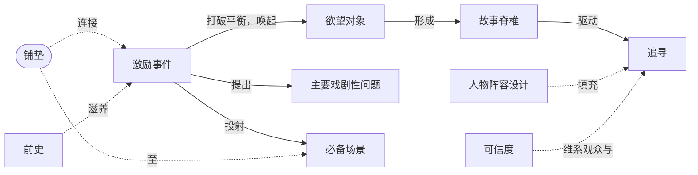

# 第8章：激励事件

> English: [[wiki/en/chapters/chapter-08-the-inciting-incident|English]]

## 摘要
在启动故事之前，麦基回到[[setting]]（背景）的话题，要求更深入的研究：作家必须了解世界的工作、政治、仪式、价值、人物传记、[[backstory]]（前史）与[[cast-design]]（人物阵容设计）。研究饱和之后，便产生**作者性**——"作者/权威/可信"三位一体。观众由两扇门进入故事：**共情**与**可信**；任何一扇失守，投入便崩塌。

随后麦基给出[[inciting-incident]]（激励事件）的定义：讲述的第一个重大事件，**从根本上打破主人公生活中的力量平衡**，唤起恢复平衡的欲望。由此产生[[object-of-desire]]（欲望对象）和[[the-quest]]（追寻）。那深层的、往往是潜意识的欲望，构成故事的[[spine]]（脊椎）。观众目睹激励事件，便提出[[major-dramatic-question]]（主要戏剧性问题，"此事将如何收场？"），并在想象中投射出[[obligatory-scene]]（必备场景）——那场与对抗力量最高潮的对决，讲述者因此负有**必须兑现**的合同。本章的深层结构命题由此确立：**一切故事都是一场追寻**，由一个激变事件发动，指向一次必然的对决，由欲望之脊贯穿始终。

## 引入的核心概念
- **[[inciting-incident]]**（Inciting Incident）— 第一个重大事件；打破平衡，唤起欲望，推动追寻。
- **[[object-of-desire]]**（Object of Desire）— 主人公觉得能恢复平衡的那个具体之物。
- **[[spine]]**（Spine）— 贯穿一切故事元素的深层欲望，通常是潜意识的。
- **[[the-quest]]**（The Quest）— 故事的普遍形式：人物穿越对抗去追求欲望对象。
- **[[major-dramatic-question]]**（Major Dramatic Question）— "此事如何收场？"——抓住观众注意力的问题。
- **[[obligatory-scene]]**（Obligatory Scene）— 与对抗力量的最高潮对决；由激励事件许诺，作家必须兑现。
- **[[foreshadowing]]**（Foreshadowing）— 早期事件为后续事件做准备的安排；将激励事件与危机相连。
- **[[cast-design]]**（Cast Design）— 每个角色皆有其设计目的；首要原则是态度的两极化。
- **[[authenticity]]**（Authenticity）— 赢得观众自愿悬置怀疑的内在一致性。
- **[[backstory]]**（Backstory）— 用以构建故事递进的过去重大事件（非人物传记）。

## 关键案例
- **[[kramer-vs-kramer]]**（*克莱默夫妇*）— 克莱默太太在开场两分钟抛夫弃子：无需铺垫的激励事件。
- **[[jaws]]**（*大白鲨*）— 鲨鱼咬人（铺垫）＋ 警长发现尸体（兑现）：两幕式激励事件。
- **[[ordinary-people]]**（*凡夫俗子*）— 法式吐司被刮进垃圾处理器：原型式"微小"激励事件。
- **[[rocky]]**（*洛奇*）— 激励事件延至30分钟，成为第一幕高潮，由艾德里安-洛奇爱情副情节铺垫。
- **[[chinatown]]**（*唐人街*）— 吉蒂斯被诱骗调查通奸的副情节，吸住观众直至主情节的激励事件成熟。
- *异形* — 丹·欧班农的"酸血"细节展示了研究驱动的可信度。

## 麦基的核心论点
一切故事都是一个故事：追寻。一个单一的激变事件把主人公推离平衡，唤起自觉与/或潜意识欲望，此欲望成为故事的脊椎，指向那场必然对决。该事件必须出现在银幕上，必须"尽早登场但不得早于时机成熟"，其质地必须与世界贴合——但它也可以小到只是"一个女人把手放在桌上，以某种方式看着你"。

## 与其他章节的联系
- 承接 [[chapter-03-structure-and-setting]]：[[setting]]所要求的研究在此回归，成为可信度与人物阵容设计的前提。
- 承接 [[chapter-07-the-substance-of-story]]：激励事件就是故事的第一个、也是最大的[[the-gap]]（鸿沟）。
- 引出 [[chapter-09-act-design]]：激励事件开启一连串[[progressive-complications]]（递进复杂化），最终抵达必备场景与高潮。

## 重要引文
- 原文："The Inciting Incident radically upsets the balance of forces in the protagonist's life."
- 译文："激励事件从根本上打破主人公生活中的力量平衡。"
- 原文："All stories take the form of a Quest."
- 译文："一切故事都采取追寻的形式。"
- 亚里士多德语（麦基转引）："可信的不可能胜于不可信的可能。"
