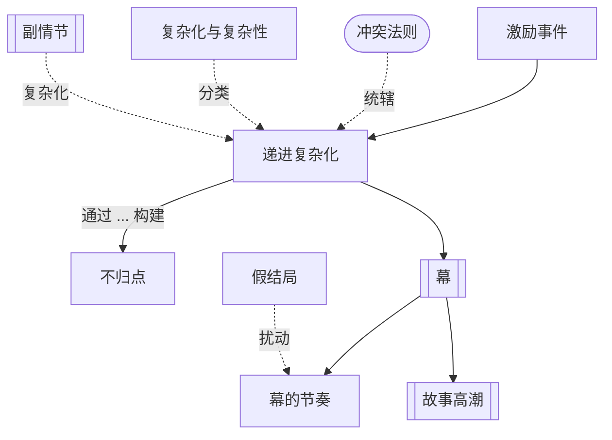

# 第9章：幕的设计

> English: [[wiki/en/chapters/chapter-09-act-design|English]]

## 摘要
从[[inciting-incident]]（激励事件）出发，故事进入漫长的躯干：[[progressive-complications]]（递进复杂化）——冲突通过连续的[[points-of-no-return]]（不归点）不断升级，一旦越过，小规模行动便永远被排除。这一躯干由**冲突法则**统辖：*在故事中，除非通过冲突，没有任何东西能向前推进*。一个人生命中冲突的总量是恒定的，变化的只是层次。麦基区分**复杂化**（冲突只在一个层次——动作片、肥皂剧、意识流）与**复杂性**（冲突同时在三个[[levels-of-conflict]]上展开——典范是《克莱默夫妇》的法式吐司场景）。

随后他给出幕结构：长篇作品至少需要**三幕**——三次重大逆转——因为两次永远不足以让观众感到抵达了极限。变体随之而来：Mid-Act Climax（幕中高潮）拯救冗长的第二幕，四到八幕结构，以及[[subplot]]（副情节）——比增加幕数更稳妥的解决方案。他以副情节的四种用法收尾——**反驳**主控思想（反讽）、**呼应**主控思想（变奏）、**铺垫**激励事件、**复杂化**主情节——再以[[act-rhythm]]（幕的节奏）作结：倒数第二幕与最后一幕的高潮必须承载相反的价值电荷。[[false-ending]]（假结局）是这一节奏之内经过计算的例外。

## 引入的核心概念
- **[[progressive-complications]]**（Progressive Complications）— 从激励事件到危机/高潮之间的递进躯干。
- **[[points-of-no-return]]**（Points of No Return）— 每道鸿沟永远取消该量级的行动，故事不能回退。
- **[[law-of-conflict]]**（Law of Conflict）— 在故事中，除非通过冲突，没有任何东西能向前推进。
- **[[complication-vs-complexity]]**（Complication vs Complexity）— 复杂化＝单层冲突；复杂性＝三层同时冲突。
- **[[subplot]]**（Subplot）— 次要情节线，用以反驳/呼应/铺垫/复杂化主情节。
- **[[act-rhythm]]**（Act Rhythm）— 倒数第二幕与最后一幕高潮的价值电荷必须相反。
- **[[false-ending]]**（False Ending）— 看似完整到让观众以为故事已结束的场景，多见于动作类型。

## 关键案例
- **[[kramer-vs-kramer]]**（*克莱默夫妇*）— "法式吐司"场景：复杂性的典范（三层冲突同时发生）。
- **[[rocky]]**（*洛奇*）— 艾德里安-洛奇爱情副情节作为"铺垫副情节"，为迟到的主情节预热。
- **[[casablanca]]**（*卡萨布兰卡*）— 五条铺垫副情节支撑开场，等待里克主情节成熟。
- *法柜奇兵*（7幕）、*厨师、大盗、他的妻子和她的情人*（8幕）— 多幕结构实例。
- *大河情*（*The River*）— 激励事件放错位置的反面教材。

## 麦基的核心论点
故事是一架由不归点铺就的梯子，每一级都取消下一级。三幕结构是最低要求而非公式：两次逆转永远无法抵达经验极限。区分持久故事的是复杂性而非复杂化；而治愈"第二幕松软腹部"的更稳妥方法是副情节而非增加幕数。幕的节奏要求交替：你不能用一个正向高潮铺垫另一个正向高潮。

## 与其他章节的联系
- 承接 [[chapter-02-the-structure-spectrum]]：[[act]]（幕）、[[sequence]]（序列）、[[scene]]（场景）、[[beat]]（节拍）至此获得宏观骨架。
- 承接 [[chapter-07-the-substance-of-story]]：递进复杂化就是鸿沟的系统性编排。
- 承接 [[chapter-08-the-inciting-incident]]：幕结构始于激励事件结束处。
- 引出后续关于危机、高潮、结局的章节。

## 重要引文
- 原文："Nothing moves forward in a story except through conflict."
- 译文："在故事中，除非通过冲突，没有任何东西能向前推进。"
- 原文："The music of story is conflict."
- 译文："故事的音乐，就是冲突。"
- 原文："You're free to break or bend convention, but for one reason only: to put something more important in its place."
- 译文："你可以打破或弯曲惯例，但只为一个理由：以更重要之物取而代之。"
