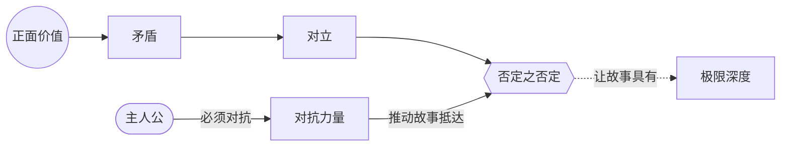

# 第14章：对抗原则

> English: [[wiki/en/chapters/chapter-14-the-principle-of-antagonism|English]]

## 摘要
麦基称对抗原则（Principle of Antagonism）"是故事设计中最重要、也最被忽视的法则"，并将其视为写作正向价值一切工作的发动机。主人公（[[protagonist]]）与故事所能达到的智识魅力与情感力量，只能与对抗力量（[[forces-of-antagonism]]）把它们推到的高度相当。薄弱的负向意味着薄弱的电影。

本章引入诊断负向力量的工具：**正面 → 矛盾 → 对立 → 否定之否定**四阶段的价值进阶（[[value-progression]]），将故事核心价值推至人类体验的极限。否定之否定（[[negation-of-the-negation]]）不是"对立面"，而是一种复合、质变更糟的状态（不公背后的暴政、仇恨背后的自我厌恶、谎言背后的自欺）。

## 引入的核心概念
- **[[principle-of-antagonism]]** 对抗原则——统御性的法则：主人公与故事只能被对抗所迫推到的高度。
- **[[forces-of-antagonism]]** 对抗力量——内在、个人、外在三层对抗之和，并非单指反派。
- **[[value-progression]]** 价值进阶——从正面经矛盾、对立直至否定之否定的递降。
- **[[negation-of-the-negation]]** 否定之否定——人类体验极限处的复合负面。

## 关键案例
- **[[chinatown]]** 唐人街——"受许可的自然性行为"的否定之否定，是与自己乱伦所生后代再度乱伦；Cross 因此是深渊之所在。
- **[[casablanca]]** 卡萨布兰卡——开场即处在否定之否定（法西斯暴政、自我憎恶、自我欺骗），向正面价值回升。
- *失踪*（*Missing*）——从不公（矛盾）→ 不义（对立）→ 暴政（否定之否定）。
- *伸张正义*（*And Justice for All*）——黑色喜剧穿越暴政再返回正面。
- *飞越未来*（*Big*）——直接跳至否定之否定，再照亮不成熟的所有灰度。

## 麦基的核心论点
"在才华、技艺、知识等其他因素相当的前提下，伟大就在于作家对负面的处理。" 与其让主人公变得更讨人喜欢，不如让对抗更强大：正向因此被迫回应。若故事停在对立，或许令人满意；唯有抵达否定之否定，才会崇高。

## 与其他章节的联系
- 扩展第7章[[chapter-07-the-substance-of-story]]——[[levels-of-conflict]]成为力量目录。
- 完善第9章[[chapter-09-act-design]]——[[progressive-complications]]的递进，本质上是沿此阶梯下行，而不是同质堆叠。
- 支撑第13章[[chapter-13-crisis-climax-resolution]]——故事抵达否定之否定时，危机处的两难（[[dilemma]]）最为沉重。
- 为第17章[[chapter-17-character]]铺路——主人公的人物维度，只有在这等压力下才能完全显露。

## 重要引文
- "主人公及其故事在智识上的吸引力和情感上的感染力，只能达到对抗力量逼迫他们达到的高度。"
- "生活不是算术——两个负数不会得到正数……事情只会越来越糟。"
- "必须抵达极限。"
