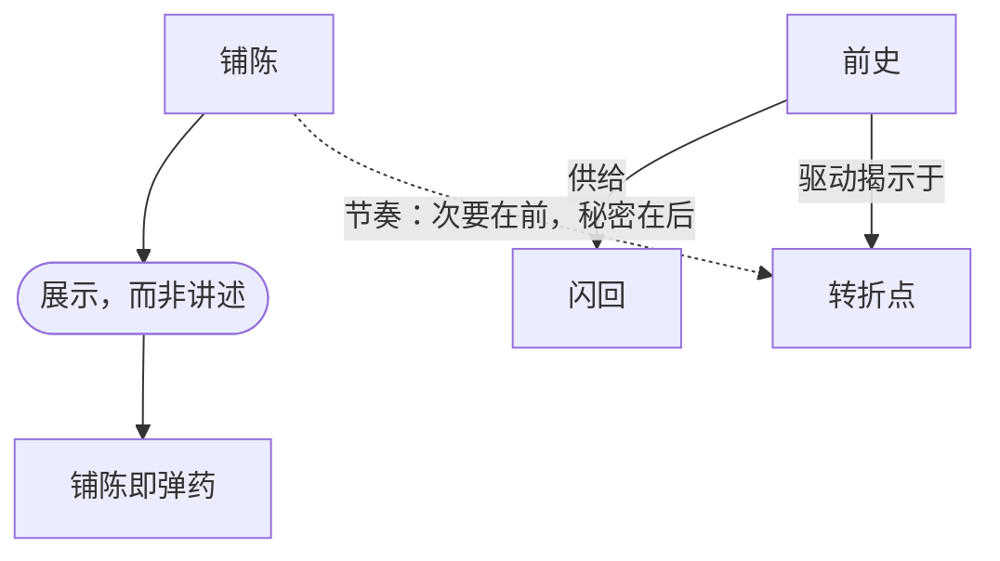

# 第15章：铺陈

> English: [[wiki/en/chapters/chapter-15-exposition|English]]

## 摘要
铺陈（[[exposition]]）是观众理解故事所必需的关于设定、人物传记、人物塑造的信息。麦基的诊断方式：仅凭剧本开头几页中铺陈的处理方式，就能判断作者的技艺。真正的技艺在于让铺陈**隐形**。

本章将"展示，而非讲述"（Show, don't tell）落实为可操作的规则：**把铺陈转化为弹药**（[[exposition-as-ammunition]]）。人物用各自已知的信息去争取自己想要的东西；观众则作为**副产品**接收到事实。同时要**节奏化**铺陈：最不重要的事实先出，关键事实最后出，最深的秘密——来自前史（[[backstory]]）——留给重大转折点（[[turning-point]]）和幕高潮。

闪回（[[flashback]]）、梦境、蒙太奇、画外音都是铺陈的形式。处理得好是戏剧化；处理得差便是"抹桌子"式的无动机铺陈，或者沦为"经典连环画"般由旁白串联的图像。

## 引入的核心概念
- **[[exposition]]** 铺陈——观众必须知道的信息，以隐形方式处理。
- **[[exposition-as-ammunition]]** 铺陈即弹药——人物将共享信息武器化为冲突工具。
- **[[flashback]]** 闪回——戏剧化的铺陈：拥有自己的激励事件、递进与转折。
- 深化：**[[backstory]]** 前史——转折点处揭示的源泉。
- 深化：[[principles/dramatize-dont-explain]] 戏剧化而非讲述——在此被落实为"把铺陈转化为弹药"。

## 关键案例
- **[[casablanca]]** 卡萨布兰卡——第二幕开场的巴黎闪回：观众已经在好奇之火中炙烤，闪回反而加速节奏。
- **[[chinatown]]** 唐人街——"她既是我妹妹也是我女儿"被留到第二幕高潮才抛出。
- **[[the-empire-strikes-back]]** 帝国反击战——"我是你父亲"是预留至最大转折点才揭示的铺陈。
- *落水狗*——Tarantino 刻意跳过激励事件的前半（抢劫失败），在仓库现场节奏转缓时切回闪回。

## 麦基的核心论点
不要写观众可以合理推断的事；不要给出缺席也不会造成理解障碍的信息。通过激发好奇制造**想知道的需要**，然后以诚实的揭示回报观众。时间艺术的第一原则：**把最好的留到最后。**

## 与其他章节的联系
- 延伸第8章[[chapter-08-the-inciting-incident]]——彼处引入的前史[[backstory]]在此被操作化。
- 驱动第10、11章[[chapter-10-scene-design]][[chapter-11-scene-analysis]]——"揭示"与"行动"是场景转折的两种手段。
- 为第18章[[chapter-18-the-text]]铺路——对白的表面承载着作为潜文本的隐形铺陈。
- 与第6章[[chapter-06-structure-and-meaning]]互参——戏剧化是意义的代价。

## 重要引文
- "铺陈的技艺，在于让它**隐形**。"
- "把铺陈转化为弹药。"
- "你不是靠给观众信息来维持他们的注意力，而是靠**保留**信息——只交出理解所必需的那一部分。"
- "把最好的留到最后。"
