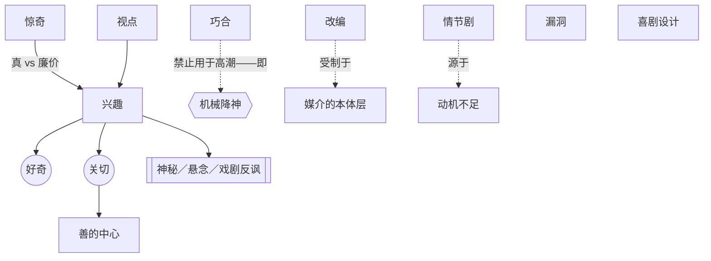

# 第16章：问题与解决办法

> English: [[wiki/en/chapters/chapter-16-problems-and-solutions|English]]

## 摘要
麦基列出八个长久的难题——兴趣、惊奇、巧合、喜剧、视点、改编、情节剧、漏洞——并为每一个提供技艺层面的解决方案。

**兴趣**需要同时抓住人性的两面：**好奇**（智识）与**关切**（情感）。观众在故事中搜寻**善的中心**（[[center-of-good]]）——情感汇聚的正面焦点。兴趣进而由三种故事／观众关系调节：**神秘／悬念／戏剧反讽**（[[mystery-suspense-dramatic-irony]]）。**惊奇**（[[surprise]]）必须是**真**（揭开被遮蔽的真相），不可是**廉价**（无见地的震动）。**巧合**（[[coincidence]]）可以早出现，却不得用在高潮——那就是"机械降神"。**视点**（[[point-of-view]]）是作者的想象位置，不是镜头的视角；固守主人公是一门创造性纪律。**改编**（[[adaptation]]）受媒介支配："小说越纯、戏剧越纯，电影越糟"。**情节剧**（[[melodrama]]）不是表达过度，而是动机不足。**漏洞**（[[hole]]）可以补、可以略过、可以认领再掩盖。**喜剧设计**（[[comic-design]]）取决于作者的愤怒、喜剧人物的偏执，以及期待与结果之间的鸿沟爆炸成笑声。

## 引入的核心概念
- **[[center-of-good]]** 善的中心——吸引观众共情的正面焦点。
- **[[mystery-suspense-dramatic-irony]]** 神秘／悬念／戏剧反讽——调节兴趣的三种故事／观众关系。
- **[[surprise]]** 惊奇——真惊奇以鸿沟带见地；廉价惊奇只震不省。
- **[[coincidence]]** 巧合——前半可以用以生成意义，高潮处致命（机械降神）。
- **[[point-of-view]]** 视点——作者的想象位置，而非镜头视角。
- **[[adaptation]]** 改编——每种媒介的本力位于不同的冲突层面；翻译实为重新发明。
- **[[melodrama]]** 情节剧——不是情感过剩，而是动机不足。
- **[[hole]]** 漏洞——逻辑断链；要么补齐，要么认领后掩盖。
- **[[comic-design]]** 喜剧设计——对社会的怒；人物的偏执；鸿沟爆炸成笑声。

## 关键案例
- *教父*、*白热*、*沉默的羔羊*——善的中心安置在表面"恶"的人物身上，通过更恶劣的环境形成对照。
- *卡萨布兰卡*、*落水狗*、*日落大道*——三种观众关系的混用。
- *大白鲨*——激励事件的巧合因留在故事中而逐渐生成意义。
- *侏罗纪公园*、*象宫鸳劫*（*Elephant Walk*）——机械降神式结局抹杀意义。
- *卡萨布兰卡*、*终结者*[[the-terminator]]——被作者认领的漏洞在被命名的同时被掩盖。
- *一条叫旺达的鱼*——以偏执定义的喜剧人物。

## 麦基的核心论点
每一个"问题"都不是前述原则的例外，而是对原则的压力测试。解决方案并未放弃转折点、鸿沟、价值转移、戏剧化，而是在特殊压力下更严格地运用它们。

## 与其他章节的联系
- 延伸第14章[[chapter-14-the-principle-of-antagonism]]——善的中心是负向力量的镜像；对抗越强，善的中心越深。
- 延伸第15章[[chapter-15-exposition]]——观众／故事关系决定了**何时**揭示。
- 锐化第10章[[chapter-10-scene-design]]——喜剧的场景转折与戏剧的转折同样利用鸿沟，只是在更高音程。
- 呼应第19章[[chapter-19-a-writers-method]]——改编部分论证了应先做处理稿，再写对白。

## 重要引文
- "最要紧的，是让观众等待。"
- "情节剧并非表达过度，而是动机不足。"
- "机械降神不仅抹杀意义和情感，它是对观众的侮辱。"
- "凡人可为之事，人类皆已为之。"
