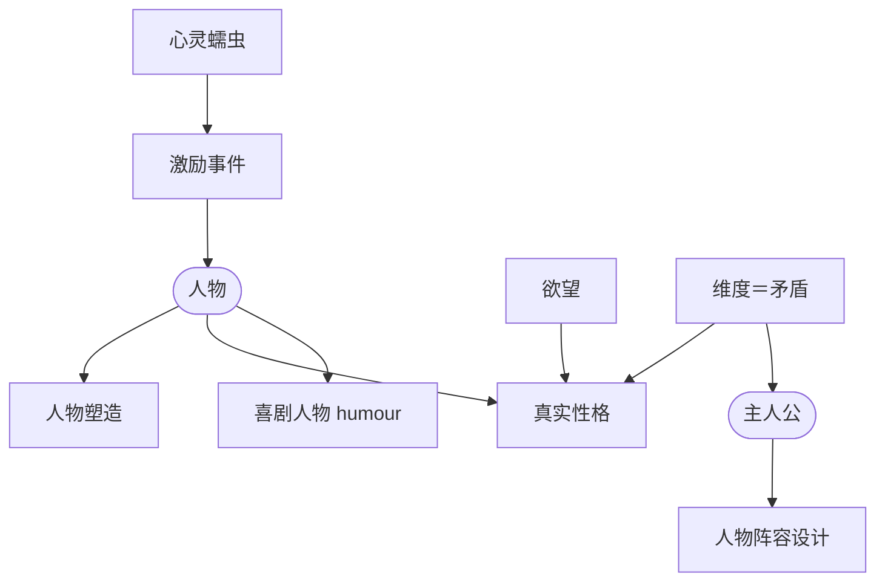

# 第17章：人物

> English: [[wiki/en/chapters/chapter-17-character|English]]

## 摘要
人物不是真实的人，而是艺术作品——**对人性的隐喻**，比我们的朋友更清晰、更可知。第17章装配全套人物工具。作家是**心灵蠕虫**（[[mind-worm]]）：钻进人物内部，为他独有的本性量身打造激励事件（[[inciting-incident]]）。

麦基锐化核心区分：**人物塑造**是可观察的（装束、口吻、职业、性格）；**真实性格**由**两难处的选择**揭示，压力越大，选择越真。人物的发动机是**欲望**（意识的与无意识的）；动机的要义**不是**把行为归因于单一的"机械解释"（童年创伤是当下的陈词），而是**保留一份神秘**。

**人物维度**（[[character-dimension]]）——最少被理解的概念——等于**矛盾**，要么在真实性格内部（愧疚的野心），要么存在于人物塑造与真实性格之间（迷人的窃贼）。这些矛盾必须**一致**。主人公必须是人物阵容中**维度最丰富**的那一个，否则善的中心（[[center-of-good]]）会失焦。**人物阵容设计**（[[cast-design]]）是一个太阳系：配角围绕主人公公转，各自牵引出他不同的矛盾面。

**喜剧人物**（[[comic-character]]）以自己**看不见的盲目偏执**（humour）为标志；一旦认出，喜剧即告终结。三则终极提醒：给演员留空间；爱你所有的人物（尤其是反派）；记住人物即**自知**。

## 引入的核心概念
- **[[mind-worm]]** 心灵蠕虫——作家角色：钻进人物，量身打造只适合他的激励事件。
- **[[character-dimension]]** 人物维度——维度＝**一致的**矛盾；主人公必须维度最丰富。
- **[[comic-character]]** 喜剧人物——带 humour 而看不见它的人物。
- 深化：**[[cast-design]]** 人物阵容设计——太阳系式的配角模型。
- 深化：**[[characterization-vs-true-character]]** 与 **[[protagonist]]**——由"维度规则"锐化。

## 关键案例
- *麦克白*——野心与愧疚互相矛盾；矛盾本身即人物。
- *哈姆雷特*——十余个维度；有史以来最复杂的人物。
- [[the-terminator|*终结者*]]——"机器／人"矛盾集于单一配角。
- *银翼杀手*——反面教材：Roy Batty 的维度让善的中心偏离了 Deckard。
- *一条叫旺达的鱼*、*乌龙帮办*——以 humour 定义的喜剧人物。

## 麦基的核心论点
"人物不是真人，正如维纳斯雕像不是真女人。" 围绕一项具体欲望与一项具体矛盾建造主人公；以阵容投射其矛盾回到他身上；从自知出发写作。爱你所有的人物，否则你无法写出他们。

## 与其他章节的联系
- 完成第5章[[chapter-05-structure-and-character]]——"结构即人物"，此处被解剖。
- 受第14章[[chapter-14-the-principle-of-antagonism]]统领——只有在这等深度的压力下，维度才会显形。
- 驱动第18章[[chapter-18-the-text]]——人物特有的声音只能来自深度准备。
- 承接第8章[[chapter-08-the-inciting-incident]]——[[cast-design]]首次在彼处出现；此处成为整套系统。

## 重要引文
- "真实性格只能通过两难处的选择得到表达。"
- "维度就是矛盾。"
- "我对人性的一切理解都来自我自己。" ——契诃夫
- "人物即其所作选择所带出的行动。"
