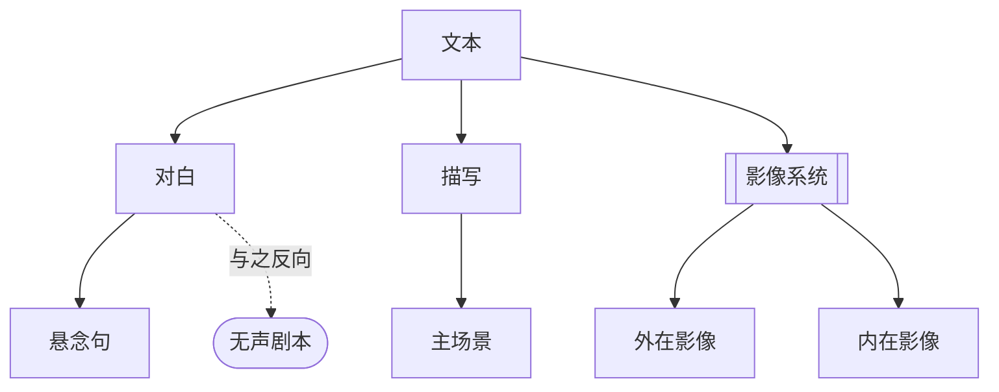

# 第18章：文本

> English: [[wiki/en/chapters/chapter-18-the-text|English]]

## 摘要
一切故事设计最终都在页面上实现。第18章剖析文本的三层：**对白**（[[dialogue]]）、**描写**（[[description]]）、以及电影诗学——**影像系统**（[[image-systems]]）。

**对白不是对话。** 日常对话以"保持通道畅通"为目的，而银幕对白要求**压缩、指向、目的**，并**听起来**像生活。倾向于短句——主语、动词、宾语——并倚重**悬念句**（[[suspense-sentence]]）：其含义被推迟到最后一个词。长台词应以行动／反应打断。最佳对白常是**无对白**——伯格曼在*沉默*中的"侍者诱惑"场景，演示了**无声剧本**（[[silent-screenplay]]）的原则：形象优先，对白是不得已的第二选择。

**描写**把影片投进读者的脑中——只写能被拍到的东西，保持**生动的现在时**，用具体名词与主动动词；删去"is/are"、"我们看到／我们听到"，以及大部分镜头标注。当代剧本是**主场景**文档：镜头通过段落的切分被**暗示**，不用"RACK FOCUS TO"这种命令去"导演"。

**影像系统**是电影的诗学：一整套母题策略，把一类意象嵌入影片、反复变奏，以潜意识的方式传达信息。分两种——**外在影像**（借用世界本就赋予的象征义，学生片的标志）与**内在影像**（在**本片范围内**创造新意义）。*悴红*（*Les Diaboliques*）把"水"这一通用积极符号反向为死亡与恐怖；*卡萨布兰卡*编织"囚禁／美国即世界／成对的相连与相离"三条线；*唐人街*组合"盲视／腐败合同／水与旱／性的残酷与爱"四条。影像系统**必须潜意识**——一旦被观众识别，象征就变得中性。

最后是**片名**。Title 即 name——命名故事中**实际存在**的东西（人物、设定、主题、类型），最好同时命名两样以上。

## 引入的核心概念
- **[[dialogue]]** 对白——压缩、指向、目的、自然，且偏短。
- **[[description]]** 描写——现在时、生动、只写能被拍到的。
- **[[image-systems]]** 影像系统——反复变奏的潜意识母题策略。
- **[[suspense-sentence]]** 悬念句——把含义推迟到最后一词的句法。
- **[[silent-screenplay]]** 无声剧本——"形象优先，对白居次"的原则。

## 关键案例
- **[[casablanca]]** 卡萨布兰卡——三条影像系统：囚禁、美国即世界、相连／相离。
- **[[chinatown]]** 唐人街——四条影像系统：盲视、腐败合同、水与旱、性的残酷与爱。
- *悴红*——把"水"反向为内在象征。
- *莫扎特传*——Salieri 的告解作为长台词的行动／反应打断范例。
- *异形2*——由*异形*的恐怖系统重新发明的"母职"影像系统。

## 麦基的核心论点
页面必须把影片投入读者的想象。形象高于语言；对白是**最后一层**，在形象与潜文本就位之后再加。诗学——影像系统——不是装饰，而是一条在意识下运行的深度通道。被观众"意识到为象征"的象征即失效。

## 与其他章节的联系
- 将第11章[[chapter-11-scene-analysis]]的文本／潜文本落实——对白是表层；潜文本由诗学和形象承载。
- 执行第15章[[chapter-15-exposition]]的"隐形铺陈"与第19章[[chapter-19-a-writers-method]]的"对白最后"。
- 在诗学层面完成第6章[[chapter-06-structure-and-meaning]]：主控思想[[controlling-idea]]是可辩论的；影像系统是在无意识里说服。

## 重要引文
- "对白不是对话。"
- "像平民那样说话，但要像智者那样思考。" ——亚里士多德（引）
- "电影对白的最佳建议就是：**别写**。"
- "影像系统**必须是潜意识的**。观众不可意识到它。"
- "电影里，一棵树就是一棵树。" ——福尔曼
