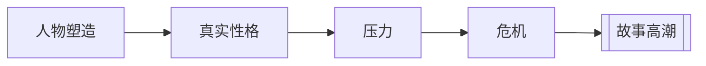

# 人物弧光（Character Arc）

> English: [[wiki/en/characters/character-arc|English]]

## 定义

最优秀的写作不仅揭示真实性格，还使其发生**弧光**变化——在叙事过程中改变内在本性，变好或变坏。人物弧光是主人公深层性格通过故事事件累积的压力从一种状态转变为另一种状态。

## 麦基的论述

麦基从小说史中追溯出人物弧光的五步模式：

1. **展示人物塑造** — 建立主人公的外在特征和角色面具。
2. **揭示真实性格** — 压力下的选择暴露角色的深层本性，往往与外在形象形成对比。
3. **对比加深** — 我们感知到表面之下隐藏的品质，角色自己尚未意识到的东西。
4. **升级的压力迫使更艰难的选择** — 越来越大的困境要求更困难、更冒险的决定。
5. **高潮深刻改变角色** — 到故事结束时，这些累积的选择已经转变了角色的内在本性。

高潮是关键时刻，而第13章进一步说明了原因：人物弧光最终并不是在动作上收束，而是在[[crisis|危机]]决策上收束。最后一次最大压力下的选择，会证明人物究竟真的变了、没有变，还是以反讽方式变了。

## 运作机制

- 弧光必须通过逐步递增的压力*赢得*——不能任意强加
- 结构和角色联锁：改变一个，就改变另一个
- 角色复杂度必须与类型匹配——动作/冒险要求简洁，教育/救赎情节要求深度
- 人物塑造可能需要调整以使高潮选择可信
- 弧光最深的检验方式，是结尾时人物面对何种两难并如何作答

## 电影案例

- **[[the-verdict|大审判]]**（*The Verdict*）— 弗兰克·加尔文：腐败的酒鬼→看到救赎的机会→与天主教会和权势体制抗争→复活为清醒、有道德的律师。案件不仅为当事人赢得了正义，也救赎了他的灵魂。
- **[[kramer-vs-kramer]]**（《克莱默夫妇》）— 泰德的人物弧光在他放弃自我胜利、转而保护儿子的时刻真正完成。
- **哈姆雷特** — 忧郁的王子→与鲁莽的未成熟搏斗的谨慎复仇者→不断升级的道德困境→平和的智慧："余下的，是沉默。"
- **《贪婪》**（*Greed*）— 莫哈维沙漠的高潮：深刻勾勒角色的极端选择，垂死的英雄将自己铐在刚杀死的对手身上——最后的意志行为。

## 与其他概念的关系

- [[characterization-vs-true-character]]（人物塑造vs.真实性格）— 弧光以这个区分为前提：改变的是*真实性格*，不仅仅是表面特征
- [[character-revelation]]（人物揭示）— 揭示是弧光的前提：你必须先看到真实性格，才能观察它的变化
- [[story-climax]]（故事高潮）— 高潮是弧光达到顶点之处；它是故事中最重要的场景
- [[crisis]]（危机）— 危机决定常是弧光完成时最清晰的暴露点

## 常见错误

- 将境遇变化与性格变化混淆——升职不是弧光
- 未能通过充分递增的压力来赢得弧光
- 改变的是人物塑造（新发型、新态度）而非真实性格
- 忽视高潮——如果最后一幕失败，弧光也失败

## 来源

- 《故事》第5章与第13章
