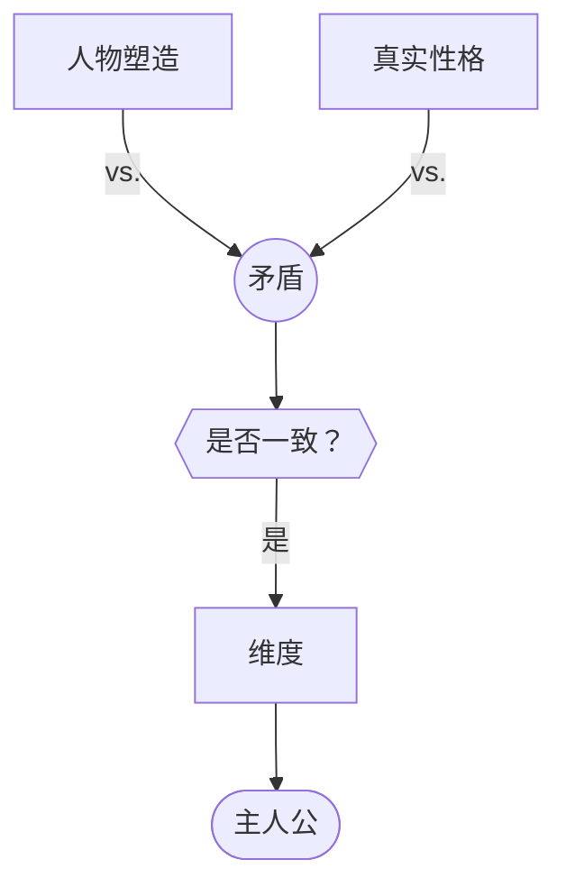

# 人物维度（Character Dimension）

> English: [[wiki/en/characters/character-dimension|English]]

## 定义
**维度**是人物身上的**一致的矛盾**，要么存在于真实性格内部（愧疚与野心），要么存在于外在人物塑造与真实性格之间（迷人的窃贼）。维度性是吸住观众注意力的东西。主人公（[[protagonist]]）**必须**是阵容中维度最丰富的那个。

## 麦基的论述
"维度"是人物概念里最少被理解的一个。它**不是**：
- 技能和怪癖的合集（空手道、萨克斯、金融）——那只是被装饰过的名字。
- 单一的主导性格（只有野心的麦克白）——性格论"大错特错"。若无愧疚，麦克白不成戏。

维度是**矛盾**。愧疚 vs. 野心；慈悲 vs. 残忍；勇气 vs. 恐惧——同在一人身上。矛盾必须**一致**（前面从头到尾温柔的男人忽然一幕踢猫，不是维度，是失误）。哈姆雷特是十余个矛盾叠加的堆栈——角色的深度正是这些对立的深度。

## 运作机制
- **跨层或内部矛盾**。要么在人物塑造与真实性格之间，要么在真实性格内部。
- **保持一致**。矛盾需贯穿整部作品；零星的矛盾读作失误。
- **随角色分量缩放**。主人公维度最丰富；配角可一至二维；群众角色应扁平，但**观察要新鲜**。
- **不要过度装饰群众角色**。给出租车司机两个维度，观众便会期待他再次出现；若他只是一幕客串，就让他扁平。
- **守住中心**。若某配角维度高于主人公，善的中心（[[center-of-good]]）会偏移（*银翼杀手* / Roy Batty 问题）。

## 电影案例
- *麦克白*——野心 vs. 愧疚。
- *哈姆雷特*——灵性／亵神；温柔／残忍；勇敢／怯懦；谨慎／冲动；慈悲／冷酷——十余条并存的矛盾。
- *卡萨布兰卡*——Rick：愤世／有节；冷漠／忠诚；自恨／磊落。
- **[[the-terminator]]** 终结者——单维反派的极致：机器 vs. 人。
- *银翼杀手*——反面教材：Roy Batty 的维度遮蔽了 Deckard。

## 与其他概念的关系
- 建立在人物塑造与真实性格（[[characterization-vs-true-character]]）的区分之上。
- 经由人物弧光（[[character-arc]]）在时间中被展开。
- 由人物阵容设计（[[cast-design]]）支持：配角的行动与反应勾勒出主人公的维度。
- 让善的中心（[[center-of-good]]）稳定在主人公身上。
- 喜剧里，维度常围绕一项隐秘偏执旋转——见喜剧人物（[[comic-character]]）。

## 常见错误
- 把特征／怪癖混作维度。
- 把"主导特质"视为深度。
- 矛盾只亮相一次就消失。
- 过度武装群众角色，制造虚假预期。
- 让配角维度超过主人公。

## 来源
- 《故事》第17章
- 《故事》第5章（人物塑造与真实性格的基础区分）
