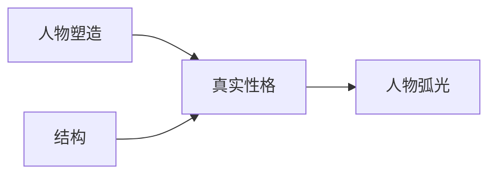

# 人物塑造 vs. 真实性格（Characterization vs. True Character）

> English: [[wiki/en/characters/characterization-vs-true-character|English]]

## 定义

**人物塑造**（Characterization）是所有可观察特质的总和——年龄、智商、性别、风格、教育、职业、个性、价值观、态度。它是面具，是表面。每个人独特的特质组合构成了他们独特的人物塑造。

**真实性格**（True Character）在人在压力下做出选择时被揭示。压力越大，揭示越深，选择越接近角色的本质。在人物塑造的表面之下，不论外表如何——这个人究竟是谁？仁慈还是残忍？慷慨还是自私？坚强还是懦弱？*唯一*了解的方式就是目睹他在压力下做出的选择。

## 麦基的论述

这个区分解决了"情节vs.角色"的争论。混淆之所以存在，是因为人们将人物塑造（表面特征）与角色（深层本性）混为一谈。结构*就是*角色，因为结构创造了迫使选择的压力。角色*就是*结构，因为选择驱动事件。

压力是必不可少的。在没有风险的情况下做出的选择毫无意义。如果一个角色在说谎毫无好处时选择说真话，这个时刻是微不足道的。但如果同一个角色在说谎可以救命时仍坚持说真话，我们就感知到诚实是他的核心。

## 运作机制

麦基的燃烧校车思想实验：一位女佣（非法移民、害羞、家庭唯一经济支柱）和一位神经外科医生（才华横溢、富有）面对一辆着火的校车。每一个递进的选择——停下还是开走？打电话求助还是冲进去？救最后一个孩子……救哪一个？——剥去人物塑造，揭示（或反驳）表面之下的本质。在最深层，即使是无意识的性别或族裔偏见也可能在执行圣人般的勇敢行为时浮现。

## 电影案例

- **詹姆斯·邦德** — 人物塑造：穿着礼服的花花公子。真实性格：有头脑的兰博。矛盾带来无尽的愉悦。
- **兰博** — 在《第一滴血》中引人入胜：人物塑造（越战独行者）与真实性格（势不可挡的杀手）矛盾。续集中两者融合为一维的平面——比周六早间动画还缺乏维度。
- **[[the-verdict|大审判]]**（*The Verdict*）— 人物塑造：英俊的波士顿律师。真实性格（首次揭示）：腐败、破产、自我毁灭的酒鬼。真实性格（弧光变化后）：一个愿意与体制抗争以拯救灵魂的人。

## 与其他概念的关系

- [[character-arc]]（人物弧光）— 弧光比揭示更进一步：它*改变*真实性格
- [[character-revelation]]（人物揭示）— 真实性格与人物塑造矛盾的那个时刻
- [[structure]]（结构）— 结构创造迫使角色做出揭示性选择的压力

## 常见错误

- 让人物塑造和真实性格完全一致——"像一块水泥，只有一种质地"——产出无聊、可预测的角色
- 将有趣的人物塑造（古怪特质、丰富背景故事）与深层角色混淆
- 认为"角色驱动"意味着"人物塑造驱动"——薄如纸巾的肖像画，深层角色未被开发和表达

## 来源

- 《故事》第5章，"人物塑造与真实性格"
