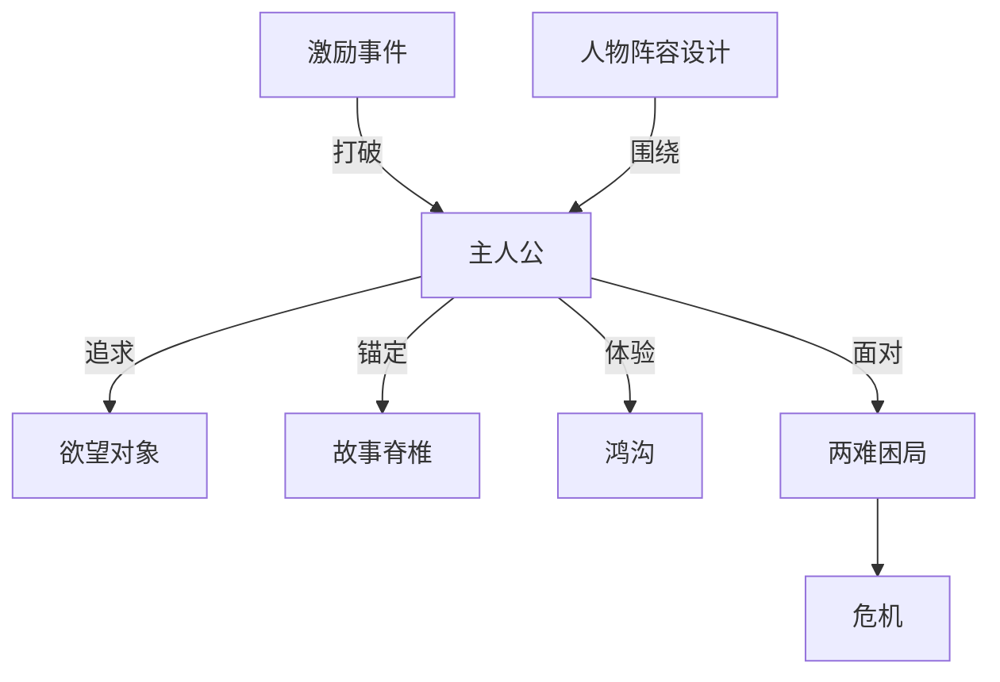

# 主人公（Protagonist）

> English: [[wiki/en/characters/protagonist|English]]

## 定义
**主人公**是具备意志力的角色，怀有清醒的（常常还有潜意识的）欲望，通过追求[[object-of-desire]]（欲望对象）、对抗敌对力量来驱动故事。主人公不必是单个人——可以是**复合主人公**（群体共享一个欲望），也可以是**多主人公**（并列欲望）。

## 麦基的论述
麦基以意志力、自觉欲望、可能相冲突的潜意识欲望、追求能力与共情基础来定义主人公。到了第10-13章，这一定义又被进一步 sharpen：主人公还是那个在场景转折、[[dilemma|两难困局]]与最终[[crisis|危机]]中不断作出选择的人。[[spine]]（故事脊椎）是这条追求线，而结尾会暴露这条追求最终把他变成了什么。

## 变体
- **单一主人公** — 最常见（*唐人街*、*克莱默夫妇*）。
- **复合主人公** — 群体共享同一欲望（*七武士*）。
- **多主人公** — 并列故事各有欲望（*汉娜姐妹*、*低俗小说*）。

## 电影案例
- *唐人街* — 吉蒂斯：意识层面在破案，潜意识层面在修补旧失败。
- **[[star-wars]]**（《星球大战》）— 卢克在结尾处通过最后的选择被真正定义。
- *窈窕淑男* — 迈克尔·多西：意识要工作，潜意识要在关系中保有诚实。

## 与其他概念的关系
- [[the-gap]]（鸿沟）— 主人公每次行动都会开启。
- [[object-of-desire]]（欲望对象）— 主人公所追求者。
- [[spine]]（故事脊椎）— 主人公追求之线。
- [[inciting-incident]]（激励事件）— 彻底打破主人公生活的平衡。
- [[cast-design]]（人物阵容设计）— 围绕主人公而建。
- [[dilemma]]（两难困局）— 暴露主人公最深的人性。
- [[crisis]]（危机）— 最终决定会揭开主人公到底是谁。

## 常见错误
- 被动主人公：被事件带动而非主动行动。
- 主人公缺乏潜意识深度——意志扁平。
- 把意志分散给两位平行主角，却不选定结构意义上的主人公。

## 来源
- 《故事》第7-9章与第13章
