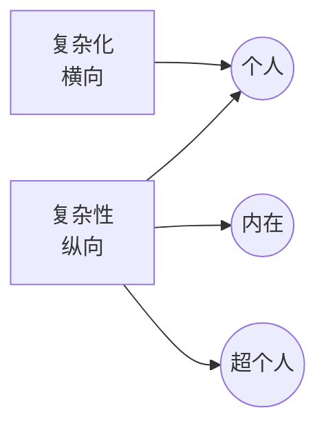

# 复杂化 vs. 复杂性（Complication vs. Complexity）

> English: [[wiki/en/comparisons/complication-vs-complexity|English]]

## 概述
麦基在两个常被混淆的词之间划出一条硬线：**复杂化**（Complication，于单一冲突层面上**横向**堆叠障碍）与**复杂性**（Complexity，在多个冲突层面上**纵向**同时奏响）。

## 核心差异

| 维度 | 复杂化 | 复杂性 |
|---|---|---|
| 轴向 | 横向（同质堆积） | 纵向（跨层级） |
| 来源 | 在同一层面堆叠敌对 | 内在、个人、超个人三个[[levels-of-conflict]]（冲突层次）同时敌对 |
| 对观众的效应 | 疲劳 | 投入 |
| 适配形式 | 动作片（其最浅层） | 经典戏剧 |
| 例证 | 一场追车接一场追车、一把枪接一把枪 | 一场戏同时是内心危机、婚姻危机与社会利害 |

## 麦基的立场
麦基强烈偏爱**复杂性**。他主张：单纯复杂化只生疲劳，不生深度。故事唯有在三个层面同时奏响冲突才能赢得其长度——否则只是长，不是丰。

## 电影案例
- **复杂化（单薄）：** 许多动作续集堆砌打斗，内在与个人利害不再加深。
- **复杂性（丰厚）：** *唐人街*每场戏都贯穿内疚、私人恋情与社会腐败三线。

## 综合分析
好的[[progressive-complications]]（递进复杂化）所"递进"的是**复杂性**，不是**复杂化**。跨幕抬升的轴是纵向的那一条。
