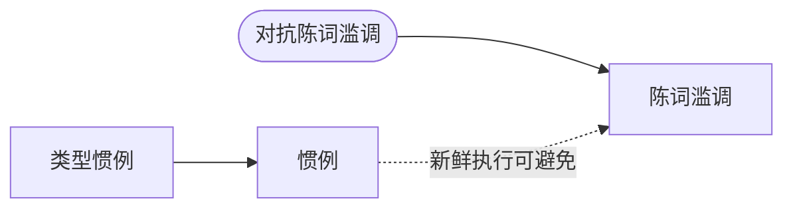

# 惯例 vs. 陈词滥调

> English: [[wiki/en/comparisons/convention-vs-cliche|English]]

## 概述

这是麦基最关键的区分之一：惯例和陈词滥调不是同一回事。混淆它们会导致作者要么拒绝类型惯例（产生无形式的作品），要么复制疲惫的模式（产生无聊的作品）。理解两者的区别，是在类型中以原创性写作的关键。

## 核心差异

| 维度 | 惯例 | 陈词滥调 |
|---|---|---|
| 本质 | 类型形式的必要元素 | 该元素的陈旧执行 |
| 层面 | *必须发生什么* | *之前怎么做的* |
| 观众反应 | 满足（期望被实现） | 厌倦（已经见过） |
| 作者的任务 | 必须履行 | 必须避免 |
| 案例 | 爱情故事中男女相遇 | 他们在单身酒吧邂逅……又来了 |
| 与类型的关系 | 定义类型 | 降格类型 |
| 来源 | 数百年来形成的观众期望 | 对前人作品的偷懒借用 |

## 麦基的立场

麦基态度鲜明：惯例不可协商。遗漏惯例会迷惑观众。挑战完全在于执行——找到新鲜、原创的方式来实现观众所期待的。"挑战在于保持惯例但避免陈词滥调。"

他将此比作诗歌：韵律方案（惯例）迫使诗人找到出人意料的词语，而这些词语反过来创造出人意料的意义。约束本身就是原创性的引擎。没有球网，网球就失去了意义；没有惯例，类型就失去了形式。

## 电影案例

- **惯例的典范：** [[chinatown|唐人街]]——履行了谋杀悬疑片"破案"的惯例，但带有毁灭性的转折：侦探破了案却无法惩罚罪犯
- **陈词滥调的典范：** 疲惫的"英雄在恶棍手下"场景中恶棍滔滔不绝而不杀人——对比《虎胆龙威》（枪粘在裸背上）或《夺宝奇兵》（直接开枪射杀刀客）中的新鲜执行

## 综合分析

惯例与陈词滥调的区分揭示了麦基手艺哲学的核心：精通不在于拒绝形式，而在于在形式中发现新的生命。回避惯例的作者并不比新鲜地履行惯例的作者更有创造力——他们只是不了解自己的类型。真正的原创是以前所未见的方式履行惯例。
