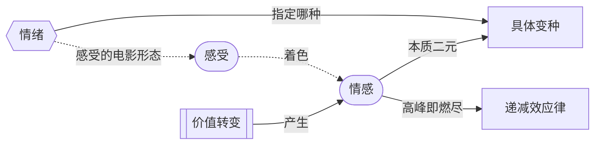

# 情感（Emotion）、感受（Feeling）与情绪（Mood）的比较

> English: [[wiki/en/comparisons/emotion-feeling-mood|English]]

## 概述

麦基的三个概念是分层的，不是并列的。**情感（Emotion）** 由价值转变产生；**感受（Feeling）** 是一种持续的内在气候；**情绪（Mood）** 是感受在电影中的化身——光线、色彩、节奏、选角、配乐。弧线给观众**电荷**；情绪给观众**风味**；交替给观众**节奏**。

## 核心差异

| 概念 | 时长 | 来源 | 作用 |
|---|---|---|---|
| **情感（Emotion）** | 短促——高峰即燃尽 | 故事中的价值转变 | 投放基本电荷（正/负） |
| **感受（Feeling）** | 长——着色数日、数周、一生 | 角色持续的内在气候 | 决定正/负中具体哪一种变种被感受到 |
| **情绪（Mood）** | 在场景或序列内持续弥漫 | 电影文本——光、色、节奏、配乐、选角 | 感受的电影形态，为情感指定变种 |

## 麦基的立场

情感的本质只有**两种**：愉悦与痛苦。其他所有被命名的情感（狂喜、恐惧、悲痛、极乐、羞辱）都是**变种**。基本电荷由一个机制产生——价值[[turning-point|转折]]。具体风味由另一个机制产生——感受，在电影中以情绪呈现。

由此衍生三条规则：

1. **没有转变，就没有情感。** 情绪无法替代弧线。情绪丰沛但无价值变化的场景是装饰品，不是故事。
2. **没有弧线的情绪是香水广告。** 情绪丰沛但无[[turning-point|转折]]的场景看似华美而死寂。参[[dramatize-dont-explain]]。
3. **重复会烧光电荷。** 见[[law-of-diminishing-returns|递减效应律]]——连续三个悲剧场景，最终成喜剧。

## 电影案例

- **《肖申克的救赎》**——*安迪越狱*：弧线承担情感。安迪从双重负面（污秽、囚禁）转到反讽性的正面（自由、重生）。雨水、配乐、旁白是情绪；瞬间的*力量*来自价值转变。换情绪——电荷不变，风味改变。换转变——只剩漂亮的雨景，故事消失。
- **《辛德勒的名单》**——*红衣女孩*：弧线是辛德勒从抽离到牵涉（负向）。黑白片的情绪 + 单一的红色，*指定*这种痛感为个体化哀伤而非统计学。换情绪等于换变种。
- **《教父》**——*洗礼蒙太奇*：弧线对迈克尔而言是正向的（巩固权力）。神圣的情绪（拉丁圣礼、管风琴、烛光）把这场胜利翻转成"沉沦"。情绪强大到能为观众指定一种他们几乎不愿感受的情感。
- **《盗梦空间》**——*四层高潮*：同一弧线（救援）重复四次，但每一层情绪不同：货车=紧迫、酒店=失重的奇异、雪堡=战术清晰、迷失域=哀伤。情绪让本来要被[[law-of-diminishing-returns|递减效应]]烧光的电荷，反而四度抵达。
- **《搏击俱乐部》**——*公寓爆炸*：同一弧线（失去）在芬奇的冷面情绪下，变成黑色的解放，而非悲伤。情绪可以"污染"变种。
- **《盗梦空间》**——*结尾*：弧线是正向的（科布回家）；但情绪（陀螺停留、配乐截断）指定了一种被不确定阴影笼罩的愉悦。情绪可以与产生它的弧线对抗。

## 综合分析

弧线给**电荷**；情绪给**风味**；交替给**节奏**。

诊断任何强力场景的小工具：先问**哪个价值转了**（这是情感），再问**用什么质地为它上色**（这是情绪）。两者都能识别，就找到了双零件机器。只能识别情绪，则那是香水广告，不是故事。

[[melodrama|情节剧]]即典型败相：情绪被开到最大，弧线却缺位——感情没有挣得理由。矫正之法永远是[[meaning-produces-emotion|意义产生情感]]。

## 来源
- 《故事》第6章（[[aesthetic-emotion|审美情感]]）
- 《故事》第13章（[[meaning-produces-emotion|意义产生情感]]）
- 《故事》第18章（[[image-systems|意象系统]]、情绪即文本）
- `sources/supplementary/Emotion, feeling, and mood in screenwriting.html`
