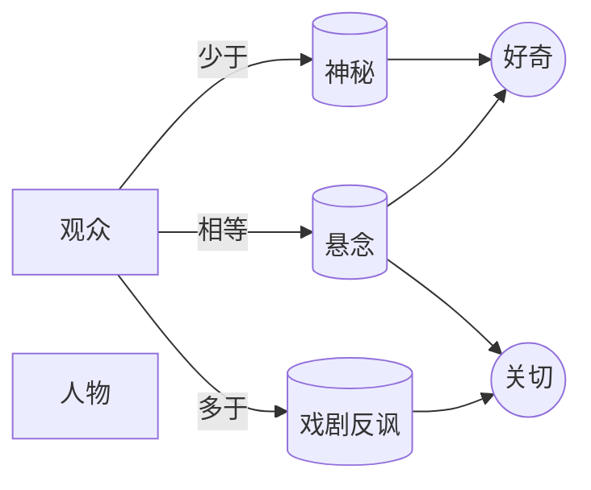

# 神秘 vs. 悬念 vs. 戏剧反讽

> English: [[wiki/en/comparisons/mystery-suspense-dramatic-irony|English]]

## 概述
麦基区分维持观众兴趣的三种**故事／观众关系**。它们不是类型，而是描述人物与观众之间的**知识不对称**。

- **神秘**（Mystery）——观众知道得**少于**人物。兴趣仅由**好奇**驱动。
- **悬念**（Suspense）——观众与人物知道得**相同**。兴趣由**好奇＋关切**双驱动。
- **戏剧反讽**（Dramatic Irony）——观众知道得**多于**人物。兴趣仅由**关切**驱动。

## 核心差异

| 维度 | 神秘 | 悬念 | 戏剧反讽 |
|---|---|---|---|
| 观众 vs. 人物知识 | 观众滞后 | 同步 | 观众超前 |
| 兴趣引擎 | 好奇 | 好奇+关切 | 关切 |
| 主导情感 | 解谜 | 焦虑、代入 | 惊惧、悲悯 |
| 结局走向 | 总是向上（侦探取胜） | 上／下／反讽 | 上／下／反讽 |
| 共情 | 仅同情（侦探太完美） | 充分代入 | 悲悯（看着角色走向已知命运） |
| 与事实的关系 | 隐藏事实（红鲱鱼） | 与人物同步揭露 | 先抛出事实，再戏剧化 |
| 天然类型 | 谋杀悬疑 | 绝大多数影片 | 常以结局开场（*日落大道*、*背叛*） |

## 麦基的立场
百分之九十的影片——喜剧与正剧——运行在**悬念**之中。纯神秘只适合一个类型（谋杀悬疑，含封闭式与开放式两种变体）。戏剧反讽是最少用、也最被低估的一种；它以情感深度换取廉价震惊。多数影片整体上是悬念，但通过**混用**自我加料：一段神秘拉升对某事实的好奇，一段戏剧反讽汇聚悲悯。

## 电影案例
- **神秘：** 克里斯蒂的封闭式；*哥伦布探长*的开放式；*非常嫌疑犯*对封闭式的戏仿。
- **悬念：** *唐人街*（[[chinatown]]）的大部分、*大白鲨*的大部分、绝大多数动作片。
- **戏剧反讽：** *日落大道*（开场即亮尸）、*背叛*（时序倒置）、希区柯克让观众看见桌下炸弹的招牌手法。
- **混合：** *卡萨布兰卡*（[[casablanca]]）——第一幕神秘（Rick 是谁？）；巴黎闪回里的戏剧反讽（结局已知）；第三幕重回神秘（Rick 打算怎么做？）。

## 综合分析
在每一个时刻，选择能够最大化你想要的情感的那种关系。事实重要时，藏起来（神秘）；结果重要时，与人物同步（悬念）；**必然性**重要、你希望观众看着人物走向不可避免之境时，把结局先亮出来（戏剧反讽）。

## 来源
- 《故事》第16章
