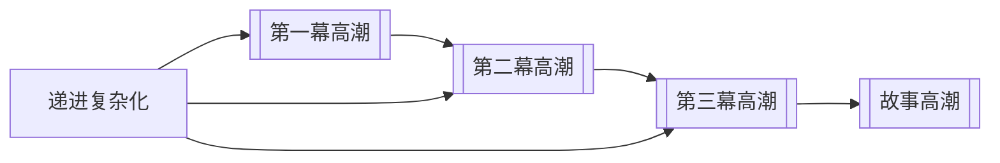

# 幕的节奏（Act Rhythm）

> English: [[wiki/en/concepts/act-rhythm|English]]

## 定义
**幕的节奏**是各幕在强度与反转力上依次抬升的节拍规律——任何一幕的高潮都不能重复上一幕的电荷。

## 麦基的论述
相邻两个幕高潮不能以相同的价值电荷、相同的强度呈现，否则后者显得冗余。经典设计编排各幕电荷，使后一幕的高潮超越或剧烈反转前一幕，而最后一幕必带来全片最强的反转。

## 电影案例
- *星球大战* — 三个幕高潮（逃离塔图因、逃离死星、毁灭死星）在利害与反转上层层递进。
- *窈窕淑男* — 喜剧性反转一幕强过一幕，终至直播中的当众揭穿。

## 与其他概念的关系
- [[act]]（幕）— 节奏是幕与幕之间的关系。
- [[progressive-complications]]（递进复杂化）— 节奏是进程的宏观形状。
- [[story-climax]]（故事高潮）— 最后一幕的高潮必须是最强的。

## 常见错误
- 相邻两幕以相同价值、相同强度达到高潮。
- 第三幕弱于第二幕。

## 来源
- 《故事》第9章
