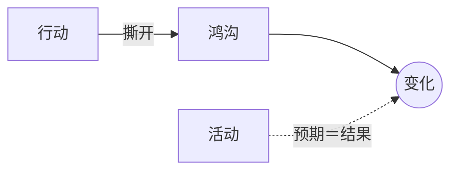

# 行动与活动（Action vs Activity）

> English: [[wiki/en/concepts/action-vs-activity|English]]

## 定义
**真正的行动**是身体、言语或心灵的动作，它撕开一道[[the-gap]]（鸿沟）并造成重要改变。单纯的**活动**只是"预期之事照常发生"的行为，产生零或微不足道的变化。

## 麦基的论述
优秀写作看重**反应**。发生什么往往由类型惯例所可预期；真正重要的是**发生在谁身上、为何、如何**——那揭示人物、激起下一个鸿沟的反应。"活动"场景——敲门、门被礼貌打开、进屋——是任何剪辑师都会剪掉的"无意义的节奏杀手"。

## 电影案例
- **[[chinatown]]**（*唐人街*）— 吉蒂斯砸门是行动；若康恩礼貌开门，则只是活动。

## 与其他概念的关系
- [[the-gap]]（鸿沟）— 行动的试金石：它是否撕开鸿沟？
- [[story-event]]（故事事件）— 故事事件是改变价值电荷的行动。
- [[no-scene-that-doesnt-turn]]（无场景不转）— 只由活动构成的场景不会转。

## 常见错误
- 为展示流程而拍流程——"这是八秒的死镜头。"
- 写不能撕开鸿沟的大动作（没有改变的追逐戏）。

## 来源
- 《故事》第7章
