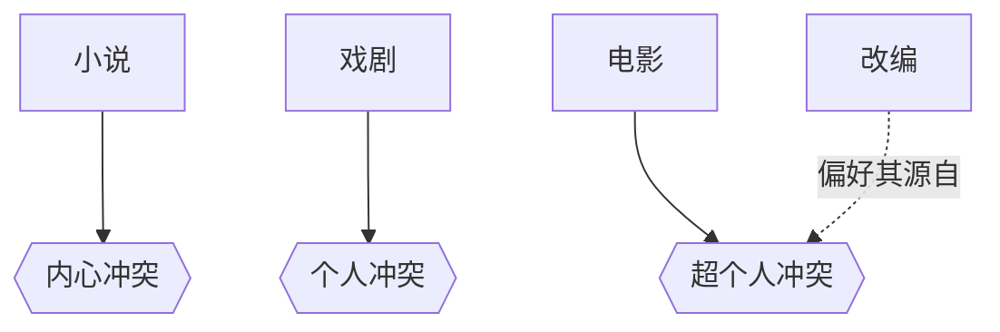

# 改编（Adaptation）

> English: [[wiki/en/concepts/adaptation|English]]

## 定义
**改编**是将故事从一种媒介翻译到另一种媒介——通常是从小说或舞台到银幕。每一种媒介在三个冲突层面（[[levels-of-conflict]]）中最擅长一项；改编被这种"本位不对称"所支配。好的改编更接近**重新发明**，而非翻译。

## 麦基的论述
- **小说**以语言的内在通道戏剧化**内心冲突**。
- **戏剧**以高度诗化的对白和现场嗓音戏剧化**个人冲突**。
- **电影**以画面戏剧化**超个人冲突**——社会、环境、行动。

由此："**小说越纯、戏剧越纯，电影越糟**。" 完全住在内心冲突里的小说（乔伊斯的《尤利西斯》）或完全住在诗化个人对白里的戏剧（艾略特的《鸡尾酒会》），没有视觉等价物；改编要么坍塌，要么稀释成对 Fellini 或 Bergman 的学生仿作。冲突分布在三个层面、偏向超个人的作品，最适合改编。

## 运作机制
- **不做笔记地反复阅读**，直至感受原作气息。
- **拆为事件**。每场一两句，不要心理分析。
- **压力测试故事**。十分之九的小说——哪怕是被热爱的——在戏剧层面讲得并不好；伟大的长篇又常常超出长片容量。
- **重新发明**。把事件按时间重排，删减、压缩、发明新场景；把心理的转成物理的。
- **接受偏离**。若重写出好电影，影评会原谅偏离原作；若屠戮原作又未拿出同级或更好的替代品，作者活该被骂。

## 电影案例
- *桂河大桥*——Boulle 的小说三层面兼备且偏超个人；Foreman 的剧本成就 Lean 的杰作之一。
- *危险关系*、*征服者佩尔*——改动激进到让"不像原著"的批评闭嘴。
- Ruth Prawer Jhabvala 对 Jean Rhys、福斯特、亨利·詹姆斯的改编——大师级再发明，源头本就偏社会／超个人冲突。
- *红字*、*虚荣的篝火*——屠戮而未替代的改编。

## 与其他概念的关系
- 受冲突层面（[[levels-of-conflict]]）及各媒介的本力支配。
- 是创造性限制（[[creative-limitation]]）的一种——在固定时长内围绕既有素材的戒律。
- 通过把心理活动转为视觉表达，产生文本与潜文本（[[text-and-subtext]]）。

## 常见错误
- 挑"纯"文学作品，幻想有电影等价物。
- 试图把小说式的自由联想转成快切与画外音。
- 出于对原作的敬畏，不敢删、不敢写、不敢重排。
- 堆叠画外音旁白，把电影变成带图的有声书。

## 来源
- 《故事》第16章
