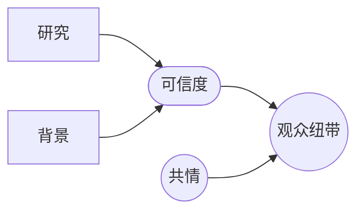

# 可信度（Authenticity）

> English: [[wiki/en/concepts/authenticity|English]]

## 定义
**可信度**是故事世界的内在一致性——在广度、深度、细节上自洽——以此赢得观众对怀疑的自愿悬置。

## 麦基的论述
观众通过两扇门进入故事：对[[protagonist]]（主人公）的**共情**，以及世界的**可信度**。可信度崩塌之时，共情也随之瓦解。可信度**不是**现实性：一个不可能存在的世界也可以完全可信（*异形*）。关键是"讲述性细节"——少数精选细节让观众的想象去补完其余。作者性孕育权威，权威孕育可信："*这个作家懂行。*"

## 电影案例
- *异形* — "卡车司机式"机组、酸血：欧班农对生物与世界的研究造就完整的可信度。
- 伯格曼《犹在镜中》— 极端经济；相信都市观众能自行填补。

## 与其他概念的关系
- [[setting]]（背景）— 可信度建立的场域。
- [[research]]（研究）— 可信度的挣来方式。
- [[war-on-cliche]]（对抗陈词滥调）— 陈词滥调即可信度的失败。
- [[story-obeys-its-world]]（故事服从其世界）— 可信度所遵循的原则。

## 常见错误
- 机械"写实"，过度研究表面而无主题指向。
- 过度铺陈，把讲述性细节淹没在杂物中。

## 来源
- 《故事》第8章
