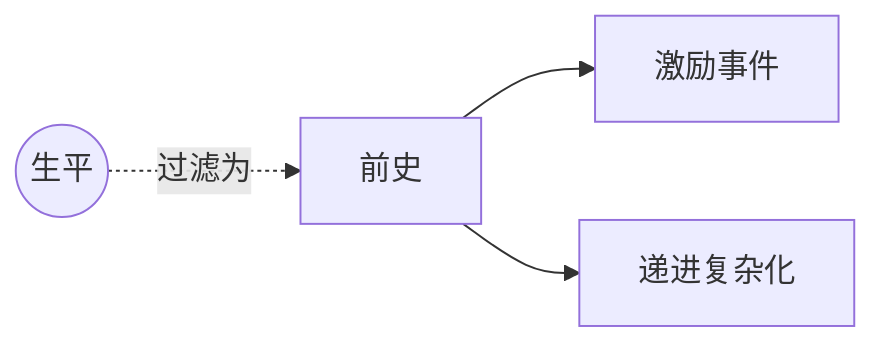

# 前史（Backstory）

> English: [[wiki/en/concepts/backstory|English]]

## 定义
**前史**是发生在人物过去、作家**可用于**构建故事递进的重大事件集合。它**不是**人物生平或履历。

## 麦基的论述
人物不是从虚空中走来，而是从一片过去事件构成的地景走来。但只有作家日后会**回收**的事件才属于前史。区分很重要：生平是仓库，前史是工具箱。

## 电影案例
- *唐人街* — 吉蒂斯过去在唐人街的失败，是让高潮沉重起来的前史。
- *凡夫俗子* — 长子溺亡与贝丝的反应，是塑造全片的前史。

## 与其他概念的关系
- [[inciting-incident]]（激励事件）— 主情节的激励事件必须在银幕上；副情节激励事件与前史事件则在过去。
- [[authenticity]]（可信度）— 前史的深度滋养世界的可信。
- [[foreshadowing]]（铺垫）— 前史事件常是铺垫的原料。

## 常见错误
- 把生平当作铺陈倾倒出来。
- 构造日后并不打算回收的前史事件。

## 来源
- 《故事》第8章
