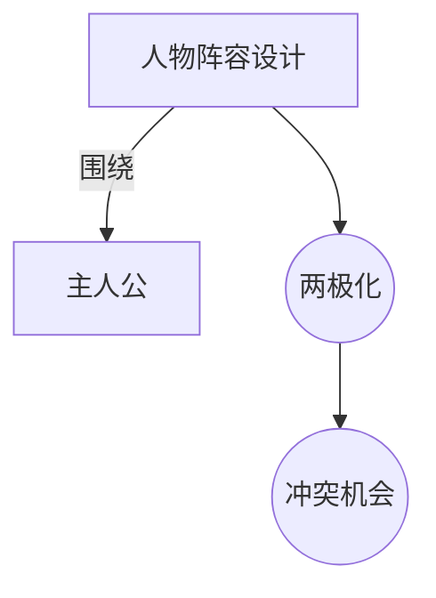

# 人物阵容设计（Cast Design）

> English: [[wiki/en/concepts/cast-design|English]]

## 定义
**人物阵容设计**是对故事群像的有意构建，使每个角色都有其存在目的。首要原则是**两极化**——角色之间形成对比或对立态度的网络。

## 麦基的论述
若两个角色态度相同、反应一致，其中之一必须被并入另一个或驱逐；否则冲突机会被最小化。理想阵容围坐晚餐时，面对同一事件每个人都给出独特且有别的反应。麦基的"爱荷华家庭-好莱坞"思想实验：众口一词的和睦家庭不出戏；两极化的家庭一口气出三场戏。

## 电影案例
- *早餐俱乐部* — 每种原型对同一留校反应各异。
- *汉娜姐妹* — 姐妹间态度两极化，催生不同的情节线。

## 与其他概念的关系
- [[protagonist]]（主人公）— 阵容设计的轴心。
- [[authenticity]]（可信度）— 两极化反应令世界真实可感。
- [[setting]]（背景）— 决定可用的态度光谱。

## 常见错误
- 配角"应声虫化"，与主人公反应一致。
- 把一种态度分拆给两个角色。

## 来源
- 《故事》第8章
