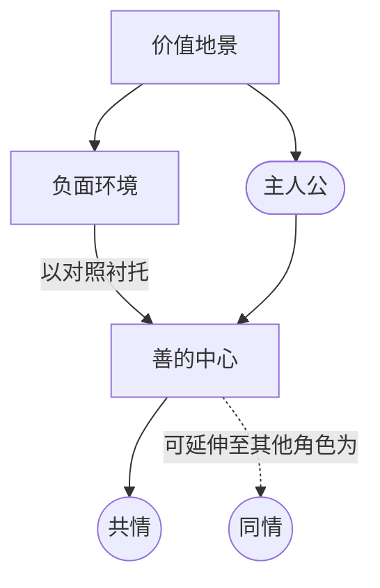

# 善的中心（Center of Good）

> English: [[wiki/en/concepts/center-of-good|English]]

## 定义
**善的中心**是观众扫视故事的价值地景时，本能寻找的那个正面焦点。情感汇向此处。主人公（[[protagonist]]）**必须**在此汇聚共情；其余角色可以承载次要的同情。

## 麦基的论述
每个人都相信自己的心是"在对的位置"，无论行为如何。希特勒认为自己在拯救欧洲。观众进入任何一个故事，都在寻找正面——不是"好人"，而是**相对于这个世界其余部分为善**的焦点。"善"的定义，既取决于它本身，也取决于它周围的一切。因此，善的中心可以放在黑帮、精神病杀手、甚至集中营恋人身上，只要其周围的世界被渲染得更加负面。

## 运作机制
- **先搭建负面世界**。善的中心是关系式的。黑暗的周围让正面可辨。
- **找到那一项救赎性特质**。一项即可：忠诚（*教父*）、幽默与镇定（汉尼拔）、真挚的爱（*午夜守门人*）、领导力（Cody Jarrett）。
- **集中于主人公**。共情必须归于主人公；其他角色可成为次级善的中心（*沉默的羔羊*中 Clarice 与 Lecter 的双中心）。
- **避免"讨喜"**。善的中心关乎**价值判断**，不关乎"宜人"。讨喜的主角活在讨喜的世界里，毫无重量。
- **让它被考验**。善的中心是对抗力量（[[forces-of-antagonism]]）驱向的位置——最终将它的价值推上审判台。

## 电影案例
- *教父*——忠诚让 Corleone 家族在背叛者的宇宙里成为相对的善的中心。
- *白热*——Cody Jarrett 的领导、机智、对母亲的爱，让他在软弱的同伙与乏味的追捕者之间成为善的中心。
- *沉默的羔羊*——双中心：Clarice 的勇气与 Lecter 的镇定智识；两者皆在堕落环境中带正电荷。
- **[[casablanca]]** 卡萨布兰卡——Rick 的节操之所以可见，正是因为周围是法西斯暴政。

## 与其他概念的关系
- 通过"关切"（好奇与关切这对之中的情感一极）锚定观众兴趣。
- 与对抗力量（[[forces-of-antagonism]]）互为镜像——二者彼此定义。
- 借主人公的真实性格（[[characterization-vs-true-character]]）表达，而非借"讨喜"。
- 受对抗原则（[[principle-of-antagonism]]）统领：对抗越强，越极端的中心也能被置为正向。

## 常见错误
- 把善的中心等同于讨喜。
- 将善的中心放在配角身上，却未意识到主人公在失去共情（*银翼杀手*中 Roy Batty 的问题）。
- 让周围世界太明亮；正面焦点没有对照。

## 来源
- 《故事》第16章
