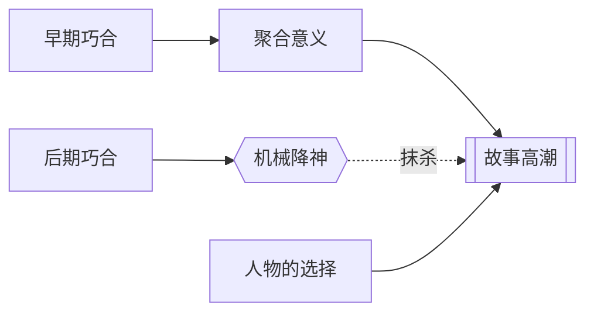

# 巧合（Coincidence）

> English: [[wiki/en/concepts/coincidence|English]]

## 定义
**巧合**是宇宙中事物随机、荒谬的相撞——本身无意义。在故事中，它的角色被严格规训：可以用来**开启**意义，绝不允许用以**终结**意义。以巧合收尾就是作家最大的罪：**机械降神**（deus ex machina）。

## 麦基的论述
故事创造意义；巧合无意义，似乎是敌人。然而巧合确是生活的一部分。解决办法是**戏剧化巧合从无意义进入、并逐渐聚合意义的过程**。早期引入的巧合可以积攒意义；高潮处的巧合抹杀整部影片的道德分量，因为它让主人公从选择的责任中脱身。

## 运作机制
- **早点引入**。让巧合留在故事中，在主人公与之周旋时聚合意义。
- **不要"用完即扔"**。一次性出现、转一场戏又消失的巧合，会被读作作者的方便之门。
- **拇指规则：过了中点不再使用**。从那里起，把故事交到人物的选择手里。
- **不得以巧合收尾**。高潮必须来自人物在压力下的行动。
- **反情节例外**：反情节影片可以从头到尾以巧合代替因果；由此生成的意义恰是"生命荒谬"——一个合法的主控思想（[[controlling-idea]]）。
- **喜剧可以宽容一点**。喜剧高潮可用巧合，前提是（a）主人公已经受够了苦；（b）他从未放弃希望。观众愿意给他一个"喘息"的权利。

## 电影案例
- **[[jaws]]** 大白鲨——鲨鱼吃人是激励事件处的巧合。它留在故事里、获得"恶意"、最终成为图腾。
- *侏罗纪公园*、*飓风*、*象宫鸳劫*、*邮差总按两次铃*、*生命中不能承受之轻*——高潮处的巧合抹杀意义。
- *淘金记*——被允许的喜剧巧合（暴风雪把卓别林吹到金矿上），因为前面吃尽苦头且从未绝望。
- *周末*、*下班后*——以巧合为结构原则的反情节影片。

## 与其他概念的关系
- 与故事高潮（[[story-climax]]）相对立——高潮意义必须来自人物在压力下的行动，而非随机事件。
- 与激励事件（[[inciting-incident]]）相容——那里可以用巧合，只要它留下来并聚合意义。
- 不可短路冲突法则（[[law-of-conflict]]）——巧合不能替代对抗。
- 决定影片能提出什么主控思想（[[controlling-idea]]）：机械降神的结尾无法做出任何连贯的论证。

## 常见错误
- 高潮处的机械降神，披着"天意"的外衣。
- 中幕处以"撞上"解决结构难题。
- 把巧合误作惊奇——惊奇必须来自鸿沟，而非随机。

## 来源
- 《故事》第16章
