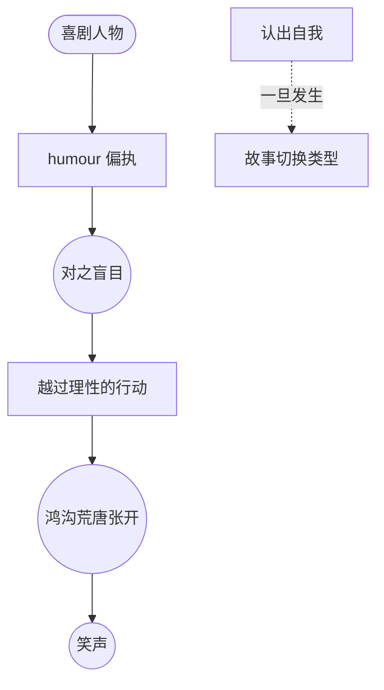

# 喜剧人物（Comic Character）

> English: [[wiki/en/concepts/comic-character|English]]

## 定义
**喜剧人物**以**盲目偏执**（humour，文艺复兴用语）为标志——他**看不见**它。喜剧人物追逐欲望的方式与戏剧人物相同，但他无法退一步问"这样会不会要了我的命"。偏执推他越过自保的阈值，直入喜剧的场景转折。

## 麦基的论述
当古希腊喜剧传统隐退后，文艺复兴作家——莫里哀、莎士比亚、琼森，以及后来的萧伯纳、王尔德、卓别林、伍迪·艾伦——重新发现了"humour"的钥匙。一位喜剧主角身上有**一项他看不见的偏执**：贪婪（*吝啬鬼*）、疑病（*无病呻吟*）、愤世（*恨世者*）、对难堪的恐惧（*一条叫旺达的鱼*的 Archie Leach）。

最重要的规则：**喜剧人物一旦认出自己的偏执，喜剧立刻结束。** 当 Archie 说出自己对难堪的恐惧，他便从喜剧主角转为言情男主（"Cary Grant"）。若 Archie Bunker 转头对邻居说"你知道，我是个种族主义憎恨者"，*一家之主*当场变成正剧。

## 运作机制
- **赋予一项 humour**。一项盲目偏执，套住整段人生。
- **让他一直盲目**。主角必须看不见自己的偏执；别人可以看见。
- **让偏执驱动**。戏剧人物会退一步时，喜剧人物迎上去。
- **多 humour 对撞**。多个喜剧人物各持不同偏执，构成合奏（*一条叫旺达的鱼*：语言、智识、动物、难堪）。
- **只在自觉时使用"认出"**。"认出"是一个可用来结束喜剧、切换类型的工具；不要误踩。

## 电影案例
- *一条叫旺达的鱼*——四种 humour 的对峙。
- *乌龙帮办*——Clouseau 的 humour：坚信自己是世上最完美的侦探。
- 莫里哀的 *吝啬鬼*、*无病呻吟*、*恨世者*——humour 结构的舞台完成态。
- *一家之主*——Archie Bunker 的"傻呆型种族偏执"humour，从未被他本人认出。

## 与其他概念的关系
- 喜剧设计（[[comic-design]]）的人物一侧。
- 人物维度（[[character-dimension]]）的特殊形态：矛盾存在于他所做与他拒看之间。
- 栖身于人物塑造与真实性格（[[characterization-vs-true-character]]）之间：真实性格不是对观众隐藏，而是对他自己隐藏。
- 把期待与结果之间的鸿沟（[[the-gap]]）张大到爆发为笑声。

## 常见错误
- 写个怪癖一筐的奇人，而非一项贯穿的 humour。
- 让喜剧主角自述自觉。
- 掺入戏剧式的自省，削掉偏执动能。
- 把多种 humour 堆给同一个角色，使喜剧稀释。

## 来源
- 《故事》第17章（喜剧人物）
- 《故事》第16章（喜剧的问题）
